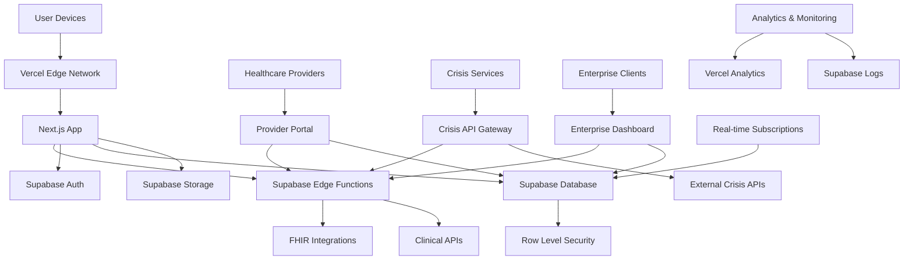
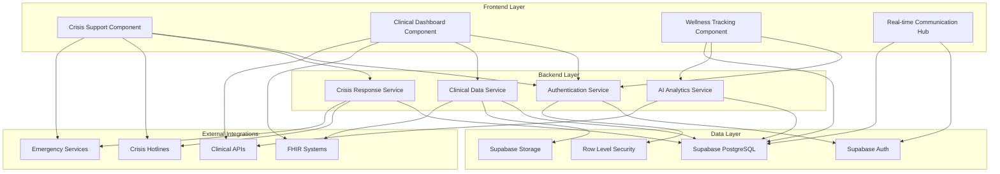

# Mental Wellness App Fullstack Architecture Document

## Introduction

This document outlines the complete fullstack architecture for **Mental Wellness App**, including backend systems, frontend implementation, and their integration. It serves as the single source of truth for AI-driven development, ensuring consistency across the entire technology stack.

This unified approach combines what would traditionally be separate backend and frontend architecture documents, streamlining the development process for modern fullstack applications where these concerns are increasingly intertwined.

### Starter Template or Existing Project

**Assessment:** This is a greenfield project with specific technology choices already defined in the PRD:
- **Frontend:** Next.js with TypeScript
- **Backend:** Supabase Backend-as-a-Service
- **Deployment:** Vercel (recommended for Next.js optimization)

**Recommendation:** We should leverage Next.js starter templates optimized for Supabase integration, specifically the **Supabase Starter Kit** or **T3 Stack with Supabase adapter**. This provides:
- Pre-configured authentication flows
- TypeScript-first development
- Optimized build pipeline
- Healthcare-ready security patterns

**Decision:** Proceed with **Next.js + Supabase + TypeScript** stack as specified in PRD, using Supabase starter template for rapid setup.

### Change Log

| Date | Version | Description | Author |
|------|---------|-------------|---------|
| 2024-09-21 | 1.0 | Initial architecture design based on PRD and UX specs | Architect |

## High Level Architecture

### Technical Summary

The Mental Wellness App employs a **modern Jamstack architecture** with Supabase Backend-as-a-Service providing real-time database, authentication, and Edge Functions for complex business logic. Next.js serves as the frontend framework with server-side rendering for SEO-optimized wellness content and API routes for webhook handling. The architecture prioritizes **healthcare compliance (HIPAA)**, **crisis intervention capabilities**, and **clinical data integration** through Row Level Security policies and FHIR-compliant APIs. Deployment leverages Vercel's global edge network for optimal performance, with Supabase handling backend scaling automatically. This approach enables rapid development while maintaining enterprise-grade security and clinical validation requirements essential for mental health applications.

### Platform and Infrastructure Choice

**Platform:** Vercel + Supabase
**Key Services:** Supabase PostgreSQL, Supabase Auth, Supabase Edge Functions, Supabase Storage, Vercel Edge Network, Vercel Analytics
**Deployment Host and Regions:** Global edge deployment (US, EU) with data residency controls for healthcare compliance

### Repository Structure

**Structure:** Monorepo with shared packages for clinical data types and business logic
**Monorepo Tool:** Turborepo (optimal Vercel integration)
**Package Organization:** Separation between consumer app, provider portal, and shared healthcare utilities

### High Level Architecture Diagram



### Architectural Patterns

- **Jamstack Architecture:** Static generation with serverless APIs for optimal performance and security - _Rationale:_ Essential for healthcare compliance and crisis intervention response times
- **Backend-as-a-Service (BaaS):** Supabase provides managed backend services - _Rationale:_ Reduces infrastructure complexity while maintaining HIPAA compliance
- **Row Level Security (RLS):** Database-level security policies - _Rationale:_ Critical for healthcare data isolation and patient privacy
- **Edge-First Computing:** Processing at edge locations - _Rationale:_ Minimizes latency for crisis intervention features
- **Component-Based UI:** Reusable React components with TypeScript - _Rationale:_ Maintainability across consumer and provider interfaces
- **Real-time Subscriptions:** Live data updates via Supabase Realtime - _Rationale:_ Essential for crisis monitoring and provider notifications
- **Progressive Web App (PWA):** App-like experience without app store dependency - _Rationale:_ Immediate crisis access without installation barriers

## Tech Stack

This is the **DEFINITIVE** technology selection for the entire Mental Wellness App project. All development must use these exact versions and choices.

### Technology Stack Table

| Category | Technology | Version | Purpose | Rationale |
|----------|------------|---------|---------|-----------|
| Frontend Language | TypeScript | 5.0+ | Type-safe development across all client code | Essential for healthcare data integrity and clinical interface reliability |
| Frontend Framework | Next.js | 14.0+ | React framework with SSR/SSG and API routes | Optimal SEO for wellness content, crisis intervention performance, built-in PWA support |
| UI Component Library | Tailwind CSS + Headless UI | Latest | Utility-first styling with accessible components | Rapid development while meeting WCAG AA compliance for mental health accessibility |
| State Management | Zustand | 4.0+ | Lightweight state management | Minimal complexity for crisis intervention interfaces, excellent TypeScript support |
| Backend Language | TypeScript | 5.0+ | Server-side logic in Edge Functions | Shared types between frontend/backend, healthcare data validation |
| Backend Framework | Supabase | Latest | Backend-as-a-Service with PostgreSQL | HIPAA compliance, real-time subscriptions for crisis monitoring, built-in auth |
| API Style | Supabase Auto-API + Edge Functions | Latest | Generated REST APIs with custom functions | Rapid development with clinical data security, custom business logic support |
| Database | PostgreSQL (Supabase) | 15+ | Primary data store with ACID compliance | Healthcare data reliability, complex querying for clinical analytics |
| Cache | Supabase Built-in + Vercel Edge | N/A | Multi-layer caching strategy | Crisis intervention performance, wellness content delivery optimization |
| File Storage | Supabase Storage | Latest | Secure file storage with CDN | HIPAA-compliant storage for clinical documents and meditation content |
| Authentication | Supabase Auth | Latest | Healthcare-grade authentication with MFA | Clinical provider verification, patient data protection, crisis escalation |
| Frontend Testing | Vitest + React Testing Library | Latest | Fast unit and integration testing | Healthcare code quality standards, component reliability |
| Backend Testing | Supabase Test Helpers + Jest | Latest | Database and Edge Function testing | Clinical data integrity validation, API reliability |
| E2E Testing | Playwright | Latest | Cross-browser end-to-end testing | Crisis intervention workflow validation, provider portal testing |
| Build Tool | Turborepo | Latest | Monorepo build orchestration | Shared clinical types, provider/consumer app coordination |
| Bundler | Webpack (Next.js built-in) | Latest | Module bundling and optimization | Crisis support offline capabilities, performance optimization |
| IaC Tool | Vercel CLI + Supabase CLI | Latest | Infrastructure as code deployment | Reproducible healthcare environments, compliance deployment |
| CI/CD | GitHub Actions | Latest | Automated testing and deployment | Healthcare quality gates, compliance validation |
| Monitoring | Vercel Analytics + Supabase Logs | Latest | Performance and error monitoring | Crisis intervention monitoring, clinical data access auditing |
| Logging | Supabase Logs + Custom Analytics | Latest | Healthcare audit trails | HIPAA compliance logging, clinical event tracking |
| CSS Framework | Tailwind CSS | 3.0+ | Utility-first CSS framework | Rapid therapeutic interface development, accessibility compliance |

## Data Models

Core data models that will be shared between frontend and backend, defining the business entities essential for mental wellness and clinical operations:

### User

**Purpose:** Primary user entity representing individuals using the mental wellness platform

**Key Attributes:**
- id: UUID - Primary identifier with Supabase auth integration
- email: string - Authentication and communication
- profile: UserProfile - Personal information and preferences
- created_at: timestamp - Account creation tracking
- last_active: timestamp - Engagement monitoring for clinical insights
- subscription_tier: enum - Free, Premium, Clinical Plus tiers
- crisis_contacts: CrisisContact[] - Emergency contact information
- provider_id: UUID? - Optional linked healthcare provider

#### TypeScript Interface

```typescript
interface User {
  id: string;
  email: string;
  profile: UserProfile;
  created_at: string;
  last_active: string;
  subscription_tier: 'free' | 'premium' | 'clinical_plus';
  crisis_contacts: CrisisContact[];
  provider_id?: string;
  privacy_settings: PrivacySettings;
}

interface UserProfile {
  first_name: string;
  last_name: string;
  date_of_birth: string;
  timezone: string;
  avatar_url?: string;
  onboarding_completed: boolean;
  wellness_goals: WellnessGoal[];
  preferred_language: string;
}
```

#### Relationships
- One-to-many with MoodEntries (user mood tracking history)
- One-to-many with ClinicalAssessments (PHQ-9, GAD-7 results)
- Many-to-one with HealthcareProvider (optional clinical relationship)
- One-to-many with NotificationPreferences

### MoodEntry

**Purpose:** Daily mood tracking data with contextual information for pattern analysis

**Key Attributes:**
- id: UUID - Primary identifier
- user_id: UUID - Foreign key to User
- mood_value: number - 1-10 scale or emotion mapping
- mood_type: enum - Scale type used (numeric, emoji, color)
- context_tags: string[] - Work, sleep, exercise, social factors
- notes: string? - Optional user notes
- recorded_at: timestamp - When mood was logged
- location_data: object? - Optional location context (privacy controlled)

#### TypeScript Interface

```typescript
interface MoodEntry {
  id: string;
  user_id: string;
  mood_value: number;
  mood_type: 'numeric' | 'emoji' | 'color' | 'binary';
  context_tags: string[];
  notes?: string;
  recorded_at: string;
  location_data?: {
    city?: string;
    weather?: string;
    timezone: string;
  };
  ai_insights?: string[];
}
```

#### Relationships
- Many-to-one with User (user's mood history)
- One-to-many with AIInsights (generated pattern recognition)

### ClinicalAssessment

**Purpose:** Validated mental health screening tools (PHQ-9, GAD-7) with clinical interpretation

**Key Attributes:**
- id: UUID - Primary identifier
- user_id: UUID - Foreign key to User
- assessment_type: enum - PHQ9, GAD7, custom clinical tools
- responses: object - Structured assessment responses
- total_score: number - Calculated assessment score
- risk_level: enum - Low, moderate, high clinical risk
- clinical_interpretation: string - Professional interpretation
- administered_at: timestamp - Assessment completion time
- administered_by: string? - Provider ID if professionally administered

#### TypeScript Interface

```typescript
interface ClinicalAssessment {
  id: string;
  user_id: string;
  assessment_type: 'PHQ9' | 'GAD7' | 'CUSTOM';
  responses: Record<string, number | string>;
  total_score: number;
  risk_level: 'low' | 'moderate' | 'high' | 'severe';
  clinical_interpretation: string;
  administered_at: string;
  administered_by?: string;
  follow_up_required: boolean;
  provider_notified: boolean;
}
```

#### Relationships
- Many-to-one with User (user's clinical history)
- Many-to-one with HealthcareProvider (if professionally administered)
- One-to-many with CrisisInterventions (if high-risk scores trigger interventions)

### HealthcareProvider

**Purpose:** Licensed mental health professionals with access to patient data and clinical tools

**Key Attributes:**
- id: UUID - Primary identifier
- email: string - Professional authentication
- professional_info: ProviderProfile - Credentials and specializations
- license_info: LicenseInfo - Professional licensing validation
- patients: User[] - Linked patient relationships
- organization_id: UUID? - Healthcare organization affiliation
- crisis_availability: object - Emergency contact preferences

#### TypeScript Interface

```typescript
interface HealthcareProvider {
  id: string;
  email: string;
  professional_info: ProviderProfile;
  license_info: LicenseInfo;
  patients: string[]; // User IDs
  organization_id?: string;
  crisis_availability: {
    emergency_phone: string;
    available_hours: TimeRange[];
    backup_provider_id?: string;
  };
  verified_at: string;
}

interface ProviderProfile {
  first_name: string;
  last_name: string;
  title: string;
  specializations: string[];
  bio: string;
  profile_image_url?: string;
}
```

#### Relationships
- One-to-many with Users (provider's patient panel)
- Many-to-one with Organization (healthcare organization)
- One-to-many with ClinicalNotes (patient interaction documentation)

### CrisisIntervention

**Purpose:** Crisis support events and interventions with escalation tracking for emergency response

**Key Attributes:**
- id: UUID - Primary identifier
- user_id: UUID - User experiencing crisis
- trigger_type: enum - Manual, automated assessment, provider initiated
- severity_level: enum - Low, medium, high, emergency
- intervention_actions: object[] - Steps taken and resources provided
- resolved_at: timestamp? - Crisis resolution time
- follow_up_required: boolean - Additional support needed
- provider_notified: boolean - Professional intervention flag

#### TypeScript Interface

```typescript
interface CrisisIntervention {
  id: string;
  user_id: string;
  trigger_type: 'manual' | 'assessment' | 'provider' | 'ai_detection';
  severity_level: 'low' | 'medium' | 'high' | 'emergency';
  intervention_actions: InterventionAction[];
  created_at: string;
  resolved_at?: string;
  follow_up_required: boolean;
  provider_notified: boolean;
  emergency_services_contacted: boolean;
}

interface InterventionAction {
  action_type: 'coping_tools' | 'crisis_hotline' | 'emergency_contact' | 'provider_call';
  timestamp: string;
  details: Record<string, any>;
  effective: boolean;
}
```

#### Relationships
- Many-to-one with User (user's crisis history)
- Many-to-one with HealthcareProvider (if provider involved)
- One-to-many with FollowUpTasks (post-crisis care)

### Organization

**Purpose:** Healthcare organizations and enterprise clients for B2B2C wellness programs

**Key Attributes:**
- id: UUID - Primary identifier
- name: string - Organization name
- type: enum - Healthcare, employer, insurer, research
- subscription_plan: enum - Basic, professional, enterprise
- admin_users: string[] - Administrative user IDs
- patient_capacity: number - Licensed user limit
- compliance_features: object - HIPAA, SOC2 requirements

#### TypeScript Interface

```typescript
interface Organization {
  id: string;
  name: string;
  type: 'healthcare' | 'employer' | 'insurer' | 'research';
  subscription_plan: 'basic' | 'professional' | 'enterprise';
  admin_users: string[];
  patient_capacity: number;
  compliance_features: {
    hipaa_required: boolean;
    audit_retention_days: number;
    data_residency: string;
    custom_branding: boolean;
  };
  billing_info: BillingInfo;
  created_at: string;
}
```

#### Relationships
- One-to-many with HealthcareProviders (organization's staff)
- One-to-many with Users (organization's covered members)
- One-to-many with ComplianceAudits (regulatory tracking)

## API Specification

The Mental Wellness App uses **Supabase auto-generated REST APIs** combined with **custom Edge Functions** for complex business logic and external integrations.

### Supabase Auto-Generated APIs

**Base URL:** `https://your-project.supabase.co/rest/v1/`
**Authentication:** Bearer token (Supabase JWT)
**Content-Type:** `application/json`

#### Core Entity Endpoints

```yaml
# Users Table API
GET /users?select=*,profile(*)
POST /users
PATCH /users?id=eq.{user_id}

# Mood Entries API
GET /mood_entries?user_id=eq.{user_id}&order=recorded_at.desc
POST /mood_entries
PATCH /mood_entries?id=eq.{entry_id}

# Clinical Assessments API
GET /clinical_assessments?user_id=eq.{user_id}&order=administered_at.desc
POST /clinical_assessments

# Healthcare Providers API
GET /healthcare_providers?id=eq.{provider_id}
PATCH /healthcare_providers?id=eq.{provider_id}

# Crisis Interventions API
GET /crisis_interventions?user_id=eq.{user_id}&order=created_at.desc
POST /crisis_interventions
```

### Custom Edge Functions

**Base URL:** `https://your-project.supabase.co/functions/v1/`

#### Crisis Management Functions

```typescript
// Crisis Assessment and Escalation
POST /crisis-assessment
{
  user_id: string;
  responses: Record<string, any>;
  location?: { lat: number; lng: number; };
}

// Emergency Services Integration
POST /emergency-services
{
  user_id: string;
  crisis_id: string;
  location: { lat: number; lng: number; };
  consent_provided: boolean;
}
```

#### Clinical Integration Functions

```typescript
// FHIR Data Export
GET /fhir-export/{user_id}
Headers: { Authorization: "Bearer {provider_token}" }

// Clinical Assessment Scoring
POST /clinical-scoring
{
  assessment_type: 'PHQ9' | 'GAD7';
  responses: Record<string, number>;
}

// Provider Notifications
POST /provider-notifications
{
  provider_id: string;
  patient_id: string;
  alert_type: 'assessment' | 'crisis' | 'engagement';
  priority: 'low' | 'medium' | 'high';
}
```

#### AI and Analytics Functions

```typescript
// Mood Pattern Analysis
POST /mood-analytics
{
  user_id: string;
  timeframe: 'week' | 'month' | 'quarter';
}

// Personalized Content Recommendations
GET /content-recommendations/{user_id}
{
  mood_context?: string;
  time_available?: number; // minutes
  content_types?: string[];
}

// Risk Prediction
POST /risk-prediction
{
  user_id: string;
  include_external_factors?: boolean;
}
```

## Components

Major logical components across the fullstack architecture, organized by responsibility and technology layer:

### Frontend Components

#### Crisis Support Component

**Responsibility:** Immediate crisis intervention interface with emergency escalation capabilities

**Key Interfaces:**
- CrisisButton (persistent floating action button)
- CrisisAssessment (guided crisis evaluation)
- EmergencyServices (direct 911/crisis hotline integration)
- CopingTools (immediate intervention techniques)

**Dependencies:** Supabase Realtime, Geolocation API, Notification API
**Technology Stack:** Next.js + TypeScript, Tailwind CSS, Headless UI for accessibility

#### Clinical Dashboard Component

**Responsibility:** Healthcare provider interface for patient monitoring and clinical workflow management

**Key Interfaces:**
- PatientList (provider's patient panel with priority indicators)
- ClinicalAssessments (PHQ-9, GAD-7 administration and results)
- AlertManagement (crisis notifications and follow-up tasks)
- ProgressReporting (patient outcome tracking and documentation)

**Dependencies:** Supabase RLS policies, FHIR integration APIs, provider authentication
**Technology Stack:** Next.js with server-side rendering, Chart.js for clinical visualizations

#### Wellness Tracking Component

**Responsibility:** Daily wellness data collection and progress visualization for consumers

**Key Interfaces:**
- MoodLogger (quick daily mood tracking with context)
- ProgressCharts (wellness trends and goal achievement)
- ContentRecommendations (personalized meditation and wellness content)
- GoalManagement (wellness objective setting and tracking)

**Dependencies:** Supabase client, AI recommendation engine, offline storage
**Technology Stack:** React with Zustand state management, D3.js for data visualization

### Backend Components

#### Authentication & Authorization Service

**Responsibility:** Healthcare-grade user authentication with role-based access control

**Key Interfaces:**
- UserAuth (registration, login, MFA)
- ProviderVerification (professional license validation)
- RoleManagement (patient, provider, admin, enterprise permissions)
- SessionManagement (secure token handling and refresh)

**Dependencies:** Supabase Auth, external license verification APIs
**Technology Stack:** Supabase Edge Functions with TypeScript

#### Clinical Data Service

**Responsibility:** HIPAA-compliant clinical data processing and FHIR integration

**Key Interfaces:**
- AssessmentProcessing (PHQ-9, GAD-7 scoring and interpretation)
- FHIRExport (clinical data exchange with EHR systems)
- ClinicalAlerts (provider notifications for high-risk patterns)
- AuditLogging (comprehensive healthcare data access tracking)

**Dependencies:** Clinical assessment APIs, FHIR libraries, healthcare audit systems
**Technology Stack:** Supabase Edge Functions with healthcare compliance libraries

#### Crisis Response Service

**Responsibility:** Real-time crisis detection and emergency response coordination

**Key Interfaces:**
- CrisisDetection (AI-powered risk pattern recognition)
- EmergencyCoordination (crisis hotline and emergency services integration)
- EscalationManagement (provider notification and intervention tracking)
- FollowUpOrchestration (post-crisis care coordination)

**Dependencies:** External crisis APIs, geolocation services, real-time communication
**Technology Stack:** Supabase Edge Functions with external API integrations

### Integration Components

#### Real-time Communication Hub

**Responsibility:** Live data synchronization and instant notification delivery

**Key Interfaces:**
- RealtimeSubscriptions (mood updates, crisis alerts, provider messages)
- PushNotifications (crisis interventions, appointment reminders, wellness nudges)
- WebRTCSupport (future video therapy session capability)

**Dependencies:** Supabase Realtime, push notification services, WebRTC libraries
**Technology Stack:** Supabase Realtime subscriptions, service workers for offline support

## Component Diagrams



The component architecture prioritizes **healthcare compliance** and **crisis intervention capabilities** while maintaining clear separation of concerns between consumer wellness features and clinical functionality.