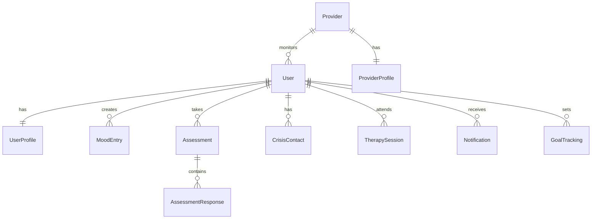

# Data Models - Mental Wellness App

## Database Schema

### Core Entity Relationships



### TypeScript Interface Definitions

#### User Management

```typescript
interface User {
  id: string;                    // UUID primary key
  email: string;                 // Unique email address
  email_verified: boolean;       // Email verification status
  created_at: Date;             // Account creation timestamp
  updated_at: Date;             // Last profile update
  last_sign_in_at: Date;        // Last authentication
  subscription_tier: 'free' | 'premium' | 'clinical_plus';
  status: 'active' | 'inactive' | 'suspended';

  // Relationships
  profile: UserProfile;
  mood_entries: MoodEntry[];
  assessments: Assessment[];
  crisis_contacts: CrisisContact[];
  provider_id?: string;          // Optional healthcare provider assignment
}

interface UserProfile {
  id: string;
  user_id: string;               // Foreign key to User
  first_name: string;
  last_name: string;
  date_of_birth: Date;
  gender?: 'male' | 'female' | 'non_binary' | 'prefer_not_to_say';
  timezone: string;              // IANA timezone identifier
  language_preference: string;   // ISO 639-1 language code

  // Clinical Information
  emergency_contact_name?: string;
  emergency_contact_phone?: string;
  emergency_contact_relationship?: string;

  // Privacy & Consent
  data_sharing_consent: boolean;
  marketing_consent: boolean;
  crisis_intervention_enabled: boolean;
  provider_data_sharing: boolean;

  // Onboarding
  onboarding_completed: boolean;
  wellness_goals: string[];      // Array of selected goals
  mental_health_history?: string;
  current_treatments?: string;

  created_at: Date;
  updated_at: Date;
}
```

#### Clinical Assessment System

```typescript
interface Assessment {
  id: string;
  user_id: string;
  assessment_type: 'phq9' | 'gad7' | 'wellness_check' | 'custom';
  version: string;               // Assessment version for clinical tracking

  // Responses and Scoring
  responses: number[];           // Array of numerical responses
  total_score: number;
  severity_level: 'minimal' | 'mild' | 'moderate' | 'moderately_severe' | 'severe';
  interpretation: string;        // Clinical interpretation text

  // Risk Assessment
  crisis_risk_level: 'low' | 'moderate' | 'high' | 'immediate';
  suicide_risk_indicated: boolean;
  requires_immediate_attention: boolean;

  // Clinical Context
  triggered_by?: 'scheduled' | 'mood_decline' | 'user_initiated' | 'provider_requested';
  provider_notified: boolean;
  provider_reviewed: boolean;
  provider_notes?: string;

  // Metadata
  started_at: Date;
  completed_at?: Date;
  time_to_complete_seconds?: number;
  created_at: Date;
}

interface AssessmentQuestion {
  id: string;
  assessment_type: string;
  question_number: number;
  question_text: string;
  response_options: {
    value: number;
    label: string;
    description?: string;
  }[];
  clinical_weight: number;       // Weight for scoring calculation
  crisis_indicator: boolean;     // Flags questions that indicate crisis risk
}

interface AssessmentResponse {
  id: string;
  assessment_id: string;
  question_id: string;
  response_value: number;
  response_text?: string;        // For open-ended responses
  response_time_seconds: number;
  created_at: Date;
}
```

#### Mood Tracking

```typescript
interface MoodEntry {
  id: string;
  user_id: string;

  // Core Mood Metrics (1-10 scale)
  mood_score: number;            // Overall mood rating
  energy_level: number;          // Energy/motivation level
  anxiety_level: number;         // Anxiety intensity
  stress_level: number;          // Stress intensity
  sleep_quality?: number;        // Previous night's sleep quality

  // Contextual Information
  notes?: string;                // User's free-text notes
  activities?: string[];         // Activities performed that day
  triggers?: string[];           // Identified mood triggers
  coping_strategies?: string[];  // Coping strategies used

  // Environmental Factors
  weather?: string;              // Weather conditions
  location?: string;             // General location (city level)
  social_interactions?: 'none' | 'minimal' | 'moderate' | 'high';

  // Clinical Indicators
  medication_taken: boolean;
  therapy_session_today: boolean;
  crisis_episode: boolean;

  // Metadata
  entry_date: Date;              // Date being tracked (may differ from created_at)
  entry_method: 'manual' | 'reminder' | 'check_in' | 'crisis_follow_up';
  created_at: Date;
  updated_at: Date;
}

interface MoodTrend {
  id: string;
  user_id: string;

  // Trend Analysis
  period: 'week' | 'month' | 'quarter';
  start_date: Date;
  end_date: Date;

  // Calculated Metrics
  average_mood: number;
  mood_variance: number;
  trend_direction: 'improving' | 'declining' | 'stable';
  volatility_score: number;      // How much mood varies

  // Pattern Detection
  identified_patterns: {
    pattern_type: string;
    description: string;
    confidence_score: number;
  }[];

  // Risk Assessment
  decline_detected: boolean;
  intervention_recommended: boolean;

  created_at: Date;
}
```

#### Crisis Intervention

```typescript
interface CrisisContact {
  id: string;
  user_id: string;

  // Contact Information
  name: string;
  phone: string;
  email?: string;
  relationship: string;          // e.g., "spouse", "parent", "friend"

  // Configuration
  is_primary: boolean;           // Primary emergency contact
  notify_on_crisis: boolean;     // Auto-notify on crisis detection
  notify_on_assessment: boolean; // Notify on high-risk assessments
  available_hours?: {            // When this contact is available
    start_time: string;
    end_time: string;
    days: string[];
  };

  created_at: Date;
  updated_at: Date;
}

interface CrisisEvent {
  id: string;
  user_id: string;

  // Crisis Details
  crisis_type: 'suicide_risk' | 'severe_depression' | 'panic_attack' | 'self_harm' | 'other';
  severity_level: 'low' | 'moderate' | 'high' | 'immediate';
  trigger_source: 'assessment' | 'mood_pattern' | 'user_reported' | 'provider_escalation';

  // Detection Information
  detected_at: Date;
  detection_algorithm: string;   // Which algorithm flagged the crisis
  confidence_score: number;      // Algorithm confidence (0-1)

  // Response Actions
  interventions_triggered: string[];  // Which interventions were activated
  contacts_notified: string[];        // Which emergency contacts were reached
  resources_provided: string[];       // Crisis resources shown to user
  professional_contacted: boolean;    // Was healthcare provider notified

  // Resolution
  status: 'active' | 'monitoring' | 'resolved' | 'escalated';
  resolved_at?: Date;
  resolution_method?: string;
  follow_up_required: boolean;

  // User Interaction
  user_acknowledged: boolean;
  user_response?: string;
  safety_plan_reviewed: boolean;

  created_at: Date;
  updated_at: Date;
}

interface SafetyPlan {
  id: string;
  user_id: string;

  // Warning Signs
  personal_warning_signs: string[];
  environmental_triggers: string[];

  // Coping Strategies
  self_soothing_activities: string[];
  distraction_techniques: string[];
  grounding_exercises: string[];

  // Support Network
  people_to_contact: {
    name: string;
    phone: string;
    relationship: string;
    when_to_contact: string;
  }[];

  // Professional Resources
  therapist_contact?: string;
  crisis_hotlines: string[];
  emergency_services: string[];

  // Environment Safety
  items_to_remove: string[];
  safe_locations: string[];

  // Reasons for Living
  reasons_for_living: string[];
  future_goals: string[];

  // Metadata
  last_reviewed: Date;
  provider_approved: boolean;
  created_at: Date;
  updated_at: Date;
}
```

#### Healthcare Provider Integration

```typescript
interface Provider {
  id: string;
  email: string;

  // Professional Information
  license_number: string;
  license_state: string;
  specialty: string[];
  credentials: string[];         // e.g., "MD", "LCSW", "PhD"

  // Organization
  organization_name?: string;
  department?: string;
  npi_number?: string;          // National Provider Identifier

  // Contact Information
  phone: string;
  address?: {
    street: string;
    city: string;
    state: string;
    zip_code: string;
  };

  // Platform Configuration
  patient_capacity: number;
  accepts_new_patients: boolean;
  notification_preferences: {
    crisis_alerts: boolean;
    assessment_summaries: boolean;
    weekly_reports: boolean;
    patient_milestones: boolean;
  };

  // Verification
  verification_status: 'pending' | 'verified' | 'rejected';
  verified_at?: Date;

  created_at: Date;
  updated_at: Date;
}

interface ProviderPatientConnection {
  id: string;
  provider_id: string;
  patient_id: string;

  // Connection Details
  relationship_type: 'primary_care' | 'therapist' | 'psychiatrist' | 'case_manager';
  connection_status: 'pending' | 'active' | 'inactive' | 'terminated';

  // Permissions
  can_view_mood_data: boolean;
  can_view_assessments: boolean;
  can_receive_crisis_alerts: boolean;
  can_modify_treatment_plan: boolean;

  // Clinical Context
  primary_diagnosis?: string;
  treatment_goals: string[];
  session_frequency?: string;

  // Dates
  connection_date: Date;
  last_contact_date?: Date;
  next_appointment?: Date;

  created_at: Date;
  updated_at: Date;
}
```

## Data Validation & Constraints

### Database Constraints

```sql
-- Users table constraints
ALTER TABLE users
ADD CONSTRAINT valid_subscription_tier
CHECK (subscription_tier IN ('free', 'premium', 'clinical_plus'));

-- Mood entries constraints
ALTER TABLE mood_entries
ADD CONSTRAINT valid_mood_range
CHECK (mood_score >= 1 AND mood_score <= 10);

ALTER TABLE mood_entries
ADD CONSTRAINT valid_energy_range
CHECK (energy_level >= 1 AND energy_level <= 10);

-- Assessment constraints
ALTER TABLE assessments
ADD CONSTRAINT valid_crisis_risk
CHECK (crisis_risk_level IN ('low', 'moderate', 'high', 'immediate'));

-- Crisis contacts constraints
ALTER TABLE crisis_contacts
ADD CONSTRAINT valid_phone_format
CHECK (phone ~ '^[\+]?[1-9][\d]{0,15}$');
```

### Data Retention Policies

```typescript
interface DataRetentionPolicy {
  table_name: string;
  retention_period_days: number;
  anonymization_required: boolean;
  hard_delete_after_days?: number;
  backup_required: boolean;
}

const RETENTION_POLICIES: DataRetentionPolicy[] = [
  {
    table_name: 'mood_entries',
    retention_period_days: 2555, // 7 years
    anonymization_required: true,
    backup_required: true
  },
  {
    table_name: 'assessments',
    retention_period_days: 2555, // 7 years
    anonymization_required: true,
    backup_required: true
  },
  {
    table_name: 'crisis_events',
    retention_period_days: 3650, // 10 years
    anonymization_required: false,
    backup_required: true
  }
];
```

## API Data Transfer Objects (DTOs)

### Request/Response Types

```typescript
// Assessment submission
interface SubmitAssessmentRequest {
  assessment_type: string;
  responses: {
    question_id: string;
    response_value: number;
    response_text?: string;
  }[];
}

interface AssessmentResultResponse {
  assessment_id: string;
  total_score: number;
  severity_level: string;
  interpretation: string;
  recommendations: string[];
  crisis_resources?: CrisisResource[];
}

// Mood tracking
interface CreateMoodEntryRequest {
  mood_score: number;
  energy_level: number;
  anxiety_level: number;
  stress_level: number;
  notes?: string;
  activities?: string[];
}

interface MoodTrendResponse {
  period: string;
  average_mood: number;
  trend_direction: string;
  insights: string[];
  mood_data: {
    date: string;
    mood_score: number;
  }[];
}
```