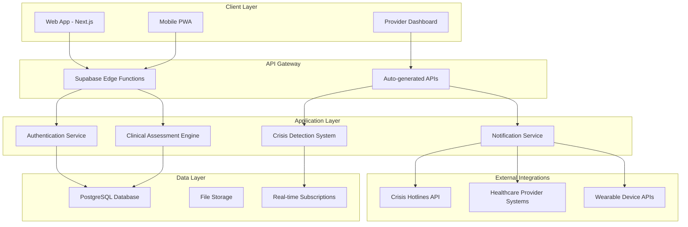

# System Architecture Overview - Mental Wellness App

## Architecture Philosophy

### Design Principles
1. **Security First:** HIPAA-compliant architecture with encryption at rest and in transit
2. **Scalability:** Horizontal scaling to support growing user base
3. **Reliability:** High availability with disaster recovery capabilities
4. **Performance:** Sub-second response times for critical mental health features
5. **Maintainability:** Clean architecture with separation of concerns

### Technology Stack Selection

#### Frontend Architecture
- **Framework:** Next.js 14 with React 18
- **Styling:** Tailwind CSS with custom therapeutic design system
- **State Management:** Zustand for client state, React Query for server state
- **Authentication:** Supabase Auth with session management
- **Accessibility:** WCAG 2.1 AA compliant components

**Rationale:** Next.js provides excellent developer experience, SEO capabilities, and performance optimization. React ecosystem offers mature mental health component libraries.

#### Backend Architecture
- **Platform:** Supabase (PostgreSQL + Auth + Real-time + Edge Functions)
- **Database:** PostgreSQL with Row Level Security (RLS)
- **API:** Auto-generated REST + GraphQL APIs with custom Edge Functions
- **File Storage:** Supabase Storage with encrypted therapeutic content
- **Real-time:** WebSocket connections for crisis intervention

**Rationale:** Supabase provides HIPAA-compliant infrastructure, reducing compliance overhead while enabling rapid development.

#### Infrastructure & DevOps
- **Hosting:** Vercel for frontend, Supabase Cloud for backend
- **CDN:** Vercel Edge Network with global distribution
- **Monitoring:** Vercel Analytics + Supabase monitoring
- **CI/CD:** GitHub Actions with automated testing and deployment
- **Security:** Automated dependency scanning and security audits

## High-Level Architecture



## Component Architecture

### Core Components

#### 1. User Management System
- **Authentication:** Multi-factor authentication with session management
- **Authorization:** Role-based access control (Patient, Provider, Admin)
- **Profile Management:** Secure personal and clinical data storage
- **Privacy Controls:** Granular consent and data sharing settings

#### 2. Clinical Assessment Engine
- **Assessment Library:** PHQ-9, GAD-7, and custom wellness assessments
- **Scoring Algorithm:** Automated calculation with clinical interpretation
- **Trend Analysis:** Historical tracking and pattern recognition
- **Provider Integration:** Secure sharing with healthcare professionals

#### 3. Crisis Intervention System
- **Risk Detection:** ML-powered analysis of assessment scores and mood patterns
- **Alert System:** Immediate notifications to users and emergency contacts
- **Resource Directory:** Location-based crisis resources and hotlines
- **Safety Planning:** Interactive safety plan creation and management

#### 4. Therapeutic Content Management
- **Content Library:** Evidence-based CBT, mindfulness, and wellness content
- **Personalization Engine:** AI-driven content recommendations
- **Progress Tracking:** User engagement and completion analytics
- **Clinical Validation:** Evidence-based content curation and updates

#### 5. Provider Dashboard
- **Patient Overview:** Aggregated wellness metrics and trends
- **Clinical Reports:** Automated generation of assessment summaries
- **Alert Management:** Crisis notifications and intervention tracking
- **Communication Tools:** Secure messaging and care coordination

## Data Architecture

### Database Schema Design

#### Core Tables
- **Users:** Authentication and basic profile information
- **UserProfiles:** Detailed demographic and clinical information
- **Assessments:** Clinical assessment responses and scores
- **MoodEntries:** Daily mood tracking data
- **CrisisContacts:** Emergency contact information
- **Providers:** Healthcare professional profiles and credentials

#### Security Implementation
- **Row Level Security (RLS):** User-specific data access controls
- **Encryption:** AES-256 encryption for sensitive health data
- **Audit Logging:** Comprehensive access and modification tracking
- **Data Retention:** HIPAA-compliant data lifecycle management

### API Design Patterns

#### RESTful API Endpoints
```
GET /api/assessments/:type        # Retrieve assessment questions
POST /api/assessments/:type       # Submit assessment responses
GET /api/mood-entries            # Retrieve mood history
POST /api/mood-entries           # Create mood entry
GET /api/crisis-resources        # Get location-based crisis resources
POST /api/crisis-alerts          # Trigger crisis intervention
```

#### Real-time Subscriptions
```sql
-- Crisis alert subscription
LISTEN crisis_alerts WHERE user_id = auth.uid();

-- Mood trend updates
LISTEN mood_updates WHERE user_id = auth.uid();

-- Provider notifications
LISTEN provider_alerts WHERE provider_id = auth.uid();
```

## Security Architecture

### Data Protection Layers
1. **Transport Security:** TLS 1.3 encryption for all communications
2. **Application Security:** Input validation and SQL injection prevention
3. **Database Security:** Encrypted storage with column-level encryption
4. **Access Control:** Multi-factor authentication and role-based permissions
5. **Network Security:** Private subnets and VPC configuration

### Compliance Implementation
- **HIPAA Compliance:** Business Associate Agreement with Supabase
- **SOC 2 Type II:** Infrastructure security controls and auditing
- **GDPR/CCPA:** Privacy controls and data portability features
- **Clinical Guidelines:** Evidence-based assessment and intervention protocols

## Performance & Scalability

### Performance Optimization
- **Frontend:** Code splitting, lazy loading, and CDN optimization
- **Database:** Query optimization, indexing, and connection pooling
- **Caching:** Redis caching for frequently accessed data
- **Images:** WebP/AVIF format optimization and responsive images

### Scalability Strategy
- **Horizontal Scaling:** Auto-scaling edge functions and database read replicas
- **Geographic Distribution:** Multi-region deployment for global users
- **Load Balancing:** Intelligent routing based on user location and load
- **Resource Management:** Efficient memory and CPU utilization monitoring

## Disaster Recovery & Business Continuity

### Backup Strategy
- **Database Backups:** Automated daily backups with 30-day retention
- **Point-in-Time Recovery:** Continuous backup for data restoration
- **Cross-Region Replication:** Real-time data synchronization
- **Backup Validation:** Regular restore testing and integrity checks

### Recovery Procedures
- **RTO (Recovery Time Objective):** ≤ 4 hours for full system restoration
- **RPO (Recovery Point Objective):** ≤ 1 hour for data loss prevention
- **Failover Process:** Automated failover to secondary regions
- **Communication Plan:** User notification and status page updates