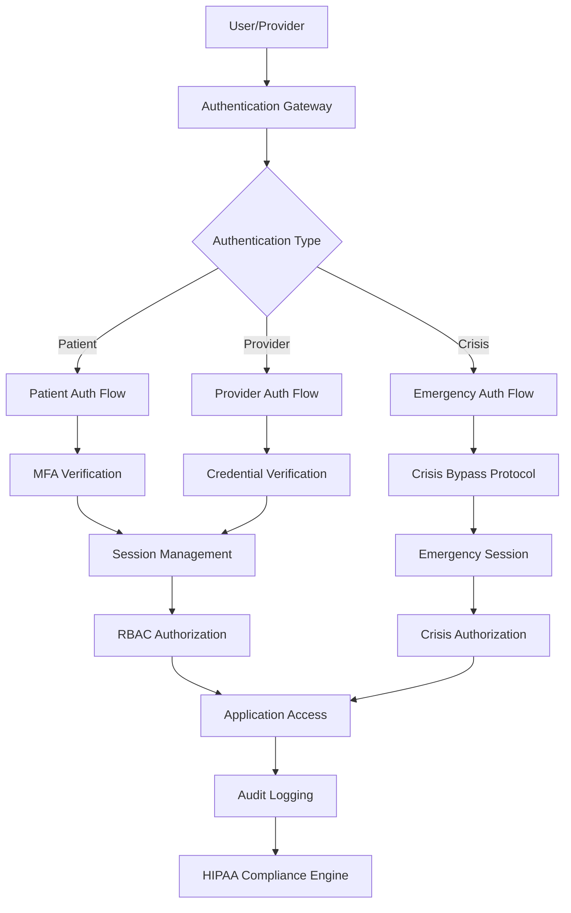
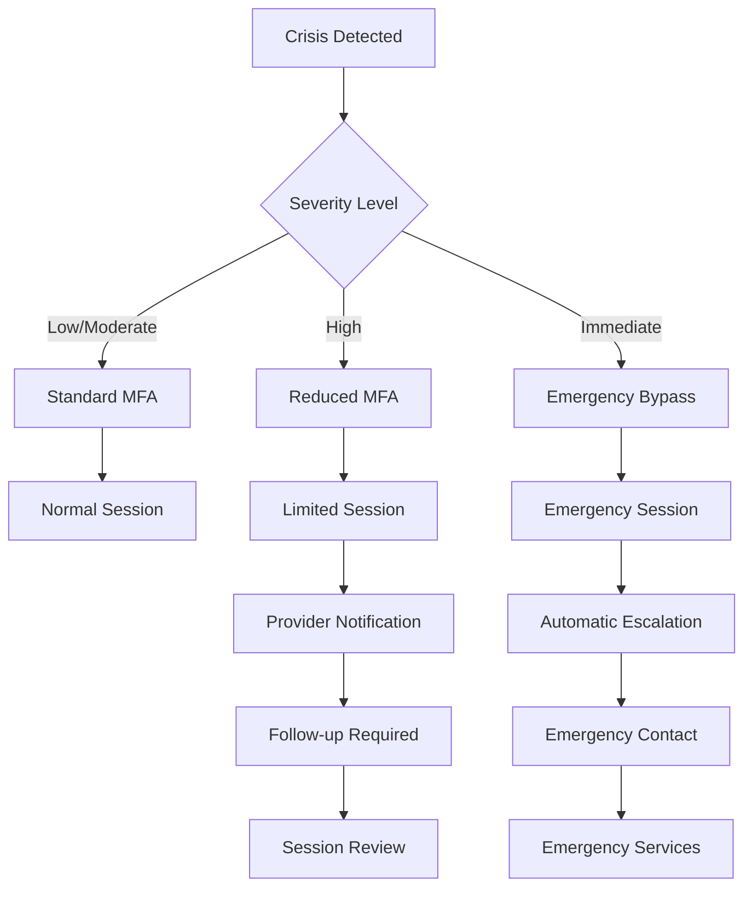
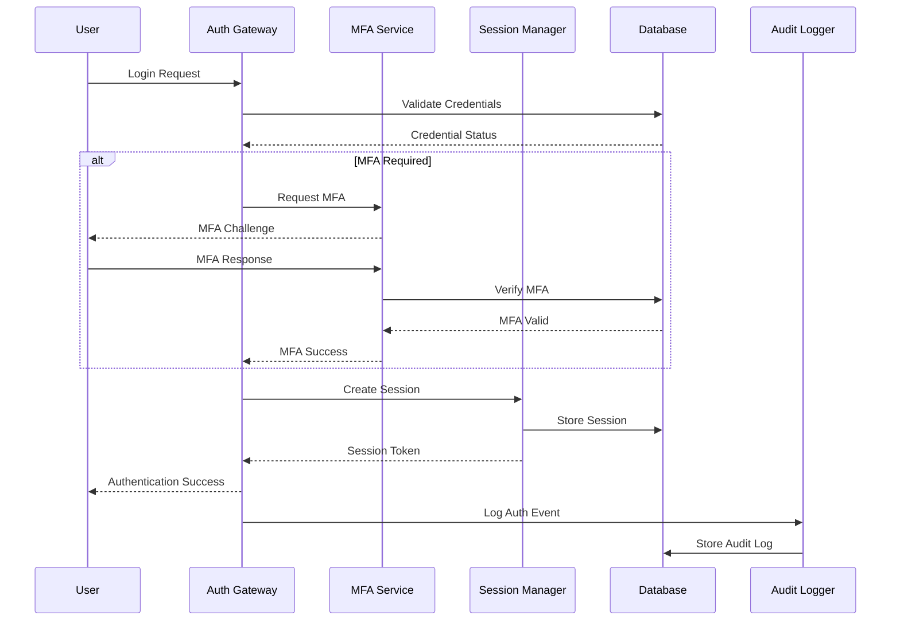
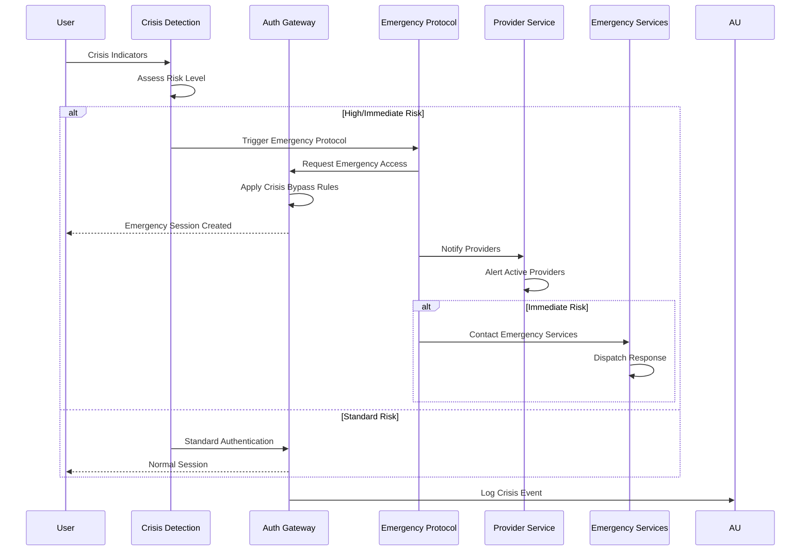
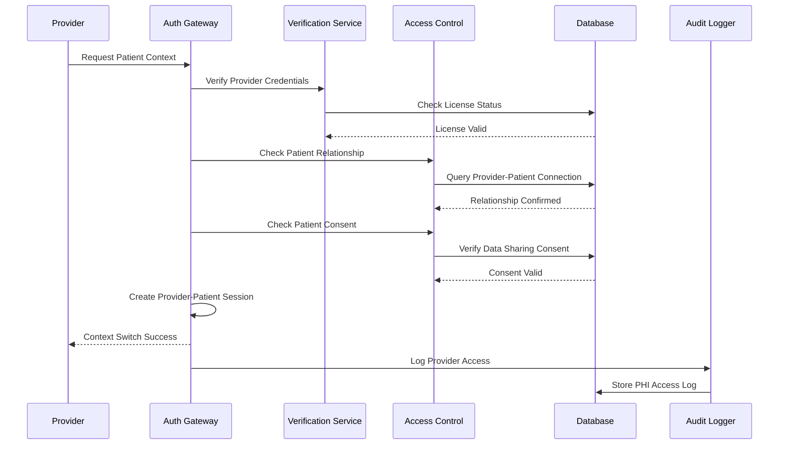
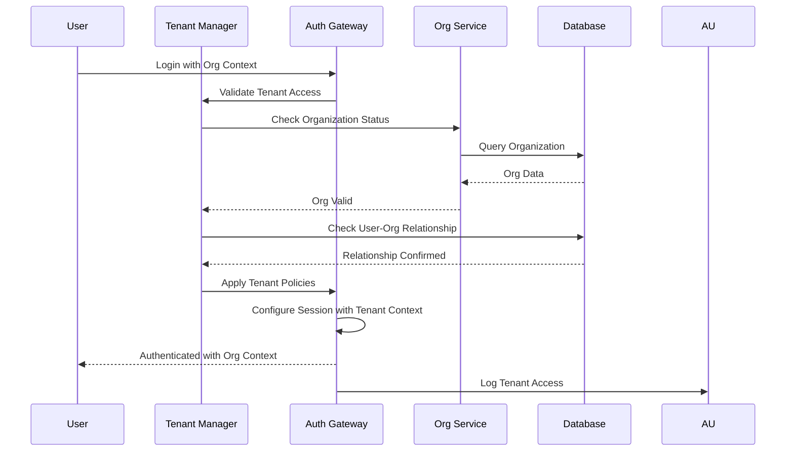

# HIPAA-Compliant Authentication Architecture
## Mental Wellness App - BMAD Architecture Design

**Version:** 1.0
**Date:** September 23, 2025
**Architect:** Sarah (BMAD Architect Agent)
**Based on PRD by:** John (PM Agent)

---

## Executive Summary

This document outlines a comprehensive HIPAA-compliant authentication architecture for the Mental Wellness App, designed to modernize the current Supabase-based authentication system while adding healthcare-specific security features, crisis intervention capabilities, and multi-tenant support for healthcare organizations.

### Key Architecture Goals
- **HIPAA BAA Compliance**: End-to-end encryption, audit trails, and access controls
- **NIST 800-63B Compliance**: Multi-factor authentication and session management
- **Crisis Intervention Support**: Emergency bypass protocols and automated escalation
- **Healthcare Provider Integration**: Professional credential verification and EHR connectivity
- **Multi-tenant Architecture**: Enterprise healthcare organization support
- **Zero-Trust Security Model**: Continuous verification and least-privilege access

---

## 1. System Architecture Overview

### 1.1 High-Level Authentication Flow



### 1.2 Core Security Principles

1. **Zero Trust Architecture**: Every request is verified regardless of source
2. **Defense in Depth**: Multiple security layers with independent controls
3. **Least Privilege Access**: Minimum necessary permissions for each role
4. **Continuous Monitoring**: Real-time threat detection and response
5. **Data Minimization**: Collect and process only essential PHI
6. **Encryption Everywhere**: Data encryption at rest, in transit, and in use

### 1.3 Authentication Tiers

| Tier | Use Case | Security Level | MFA Required | Session Duration |
|------|----------|----------------|--------------|------------------|
| Patient Standard | General app usage | Standard | Optional | 8 hours |
| Patient Sensitive | Assessments, PHI access | High | Required | 2 hours |
| Provider Standard | Patient monitoring | High | Required | 4 hours |
| Provider Clinical | Direct patient care | Critical | Required + Biometric | 1 hour |
| Crisis Emergency | Emergency intervention | Emergency | Bypass allowed | 30 minutes |
| Admin/Audit | System administration | Critical | Required + Hardware Token | 30 minutes |

---

## 2. Component Architecture

### 2.1 Authentication Components

#### 2.1.1 Enhanced useAuth Hook

```typescript
// /src/hooks/useAuth.ts
interface UseAuthConfig {
  requireMFA?: boolean;
  sessionTier?: 'standard' | 'sensitive' | 'clinical' | 'emergency';
  crisisBypass?: boolean;
  providerMode?: boolean;
  auditContext?: string;
}

interface UseAuthReturn {
  user: User | null;
  session: Session | null;
  profile: UserProfile | ProviderProfile | null;
  permissions: Permission[];
  mfaRequired: boolean;
  sessionExpiry: Date | null;
  securityLevel: SecurityLevel;
  loading: boolean;
  error: AuthError | null;

  // Authentication methods
  signIn: (credentials: AuthCredentials) => Promise<AuthResult>;
  signOut: (options?: SignOutOptions) => Promise<void>;
  refreshSession: () => Promise<Session>;

  // MFA methods
  enableMFA: (method: MFAMethod) => Promise<MFASetupResult>;
  verifyMFA: (code: string, method: MFAMethod) => Promise<boolean>;

  // Crisis methods
  requestCrisisAccess: (reason: string) => Promise<CrisisAccessResult>;
  escalateToProvider: (providerId: string) => Promise<void>;

  // Provider methods
  verifyProviderCredentials: () => Promise<CredentialStatus>;
  assumePatientContext: (patientId: string) => Promise<boolean>;
}
```

#### 2.1.2 Enhanced AuthGuard Component

```typescript
// /src/components/AuthGuard.tsx
interface AuthGuardProps {
  children: ReactNode;

  // Access control
  requiredPermissions?: Permission[];
  requiredRole?: UserRole;
  requireMFA?: boolean;
  sessionTier?: SessionTier;

  // Healthcare specific
  requireProviderVerification?: boolean;
  allowEmergencyBypass?: boolean;
  phiAccess?: boolean;

  // Crisis intervention
  crisisDetection?: boolean;
  emergencyEscalation?: boolean;

  // Redirect behavior
  redirectTo?: string;
  redirectMessage?: string;

  // Audit configuration
  auditAccess?: boolean;
  auditContext?: string;

  // Loading states
  loadingComponent?: ReactNode;
  unauthorizedComponent?: ReactNode;
  mfaComponent?: ReactNode;
}

interface CrisisAuthGuardProps extends AuthGuardProps {
  crisisLevel?: CrisisLevel;
  emergencyContacts?: EmergencyContact[];
  providerNotification?: boolean;
  bypassCode?: string;
}
```

#### 2.1.3 Session Management

```typescript
// /src/lib/session.ts
interface SessionConfig {
  tier: SessionTier;
  duration: number;
  refreshThreshold: number;
  mfaRequired: boolean;
  deviceBinding: boolean;
  geoRestriction: boolean;
}

interface SessionManager {
  createSession(user: User, config: SessionConfig): Promise<Session>;
  validateSession(sessionId: string): Promise<SessionValidation>;
  refreshSession(sessionId: string): Promise<Session>;
  elevateSession(sessionId: string, newTier: SessionTier): Promise<Session>;
  terminateSession(sessionId: string, reason: string): Promise<void>;

  // Crisis session management
  createEmergencySession(user: User, crisisContext: CrisisContext): Promise<EmergencySession>;
  escalateSession(sessionId: string, escalationType: EscalationType): Promise<void>;

  // Provider session management
  createProviderSession(provider: Provider, patientContext?: string): Promise<ProviderSession>;
  assumePatientContext(sessionId: string, patientId: string): Promise<void>;

  // Multi-tenant session management
  switchOrganizationContext(sessionId: string, orgId: string): Promise<void>;
}
```

### 2.2 Security Components

#### 2.2.1 MFA System

```typescript
// /src/lib/mfa.ts
interface MFAProvider {
  setup(userId: string, method: MFAMethod): Promise<MFASetup>;
  verify(userId: string, code: string, method: MFAMethod): Promise<boolean>;
  disable(userId: string, method: MFAMethod): Promise<void>;

  // Healthcare-specific MFA
  setupBiometric(userId: string, biometricData: BiometricData): Promise<BiometricSetup>;
  verifyBiometric(userId: string, biometricInput: BiometricInput): Promise<boolean>;

  // Emergency MFA bypass
  requestEmergencyBypass(userId: string, reason: string): Promise<BypassRequest>;
  approveEmergencyBypass(bypassId: string, approverId: string): Promise<void>;
}

type MFAMethod =
  | 'totp'           // Time-based OTP (Google Authenticator, Authy)
  | 'sms'            // SMS verification
  | 'email'          // Email verification
  | 'push'           // Push notification
  | 'hardware_token' // Hardware security key
  | 'biometric'      // Fingerprint, face recognition
  | 'backup_codes';  // Single-use backup codes
```

#### 2.2.2 Crisis Detection & Intervention

```typescript
// /src/lib/crisis.ts
interface CrisisDetectionEngine {
  analyzeRiskFactors(userId: string, context: AssessmentContext): Promise<RiskAssessment>;
  detectCrisisIndicators(data: UserData): Promise<CrisisIndicator[]>;
  triggerIntervention(userId: string, crisisLevel: CrisisLevel): Promise<InterventionResult>;

  // Emergency authentication
  createEmergencyAccess(userId: string, interventionId: string): Promise<EmergencyAccess>;
  notifyProviders(userId: string, crisisLevel: CrisisLevel): Promise<NotificationResult>;
  escalateToEmergencyServices(userId: string, context: EmergencyContext): Promise<void>;
}

interface CrisisLevel {
  severity: 'low' | 'moderate' | 'high' | 'immediate';
  indicators: string[];
  riskScore: number;
  confidence: number;
  timeWindow: number;
}
```

#### 2.2.3 Audit & Compliance System

```typescript
// /src/lib/audit.ts (Enhanced)
interface HIPAAAuditLogger extends AuditLogger {
  // HIPAA-specific logging
  logPHIAccess(access: PHIAccessEvent): Promise<void>;
  logProviderAction(action: ProviderActionEvent): Promise<void>;
  logCrisisEvent(crisis: CrisisEvent): Promise<void>;

  // Compliance reporting
  generateHIPAAReport(dateRange: DateRange): Promise<HIPAAReport>;
  generateBreachReport(incident: SecurityIncident): Promise<BreachReport>;
  generateAccessReport(userId: string, dateRange: DateRange): Promise<AccessReport>;

  // Real-time monitoring
  detectAnomalousActivity(userId: string): Promise<AnomalyDetection>;
  triggerSecurityAlert(alert: SecurityAlert): Promise<void>;

  // Data retention
  archiveAuditLogs(retentionPolicy: RetentionPolicy): Promise<void>;
  purgeExpiredLogs(cutoffDate: Date): Promise<PurgeResult>;
}
```

---

## 3. Database Schema Enhancements

### 3.1 Enhanced User Authentication Tables

```sql
-- Enhanced user profiles with HIPAA compliance
CREATE TABLE user_profiles (
  id UUID REFERENCES auth.users(id) ON DELETE CASCADE PRIMARY KEY,

  -- Basic information
  email TEXT NOT NULL,
  first_name TEXT NOT NULL,
  last_name TEXT NOT NULL,
  preferred_name TEXT,
  pronouns TEXT,
  date_of_birth DATE,
  gender gender,

  -- Contact information (encrypted)
  phone_number_encrypted BYTEA,
  address_encrypted BYTEA,
  emergency_contact_encrypted BYTEA,

  -- Healthcare information
  provider_id UUID REFERENCES provider_profiles(id),
  insurance_info_encrypted BYTEA,
  medical_record_number_encrypted BYTEA,

  -- Privacy & consent
  hipaa_consent BOOLEAN DEFAULT FALSE,
  hipaa_consent_date TIMESTAMP WITH TIME ZONE,
  data_sharing_consent JSONB DEFAULT '{}',
  research_participation_consent BOOLEAN DEFAULT FALSE,
  marketing_consent BOOLEAN DEFAULT FALSE,

  -- Crisis configuration
  crisis_plan_enabled BOOLEAN DEFAULT TRUE,
  crisis_contacts JSONB DEFAULT '[]',
  emergency_access_enabled BOOLEAN DEFAULT TRUE,

  -- Security settings
  mfa_enabled BOOLEAN DEFAULT FALSE,
  mfa_methods JSONB DEFAULT '[]',
  security_level TEXT DEFAULT 'standard',
  last_password_change TIMESTAMP WITH TIME ZONE,

  -- Multi-tenant support
  organization_id UUID REFERENCES organizations(id),
  tenant_role TEXT DEFAULT 'patient',

  -- Audit fields
  created_at TIMESTAMP WITH TIME ZONE DEFAULT NOW(),
  updated_at TIMESTAMP WITH TIME ZONE DEFAULT NOW(),
  last_audit_review TIMESTAMP WITH TIME ZONE
);

-- Provider profiles with credential verification
CREATE TABLE provider_profiles (
  id UUID REFERENCES auth.users(id) ON DELETE CASCADE PRIMARY KEY,

  -- Professional information
  license_number_encrypted BYTEA NOT NULL,
  license_state TEXT NOT NULL,
  license_expiry DATE NOT NULL,
  npi_number_encrypted BYTEA,
  dea_number_encrypted BYTEA,

  -- Specialties and credentials
  specialties TEXT[] NOT NULL,
  board_certifications JSONB DEFAULT '[]',
  professional_memberships JSONB DEFAULT '[]',

  -- Verification status
  verification_status verification_status DEFAULT 'pending',
  verified_by UUID REFERENCES auth.users(id),
  verified_at TIMESTAMP WITH TIME ZONE,
  verification_documents JSONB DEFAULT '[]',

  -- Organization affiliation
  organization_id UUID REFERENCES organizations(id) NOT NULL,
  department TEXT,
  title TEXT,

  -- Contact information
  phone_number_encrypted BYTEA NOT NULL,
  office_address_encrypted BYTEA,

  -- Clinical configuration
  patient_capacity INTEGER DEFAULT 50,
  accepts_new_patients BOOLEAN DEFAULT TRUE,
  crisis_availability JSONB DEFAULT '{}',

  -- Security settings
  mfa_required BOOLEAN DEFAULT TRUE,
  session_timeout INTEGER DEFAULT 3600, -- 1 hour

  created_at TIMESTAMP WITH TIME ZONE DEFAULT NOW(),
  updated_at TIMESTAMP WITH TIME ZONE DEFAULT NOW()
);

-- Multi-factor authentication configurations
CREATE TABLE mfa_configurations (
  id UUID DEFAULT uuid_generate_v4() PRIMARY KEY,
  user_id UUID REFERENCES auth.users(id) ON DELETE CASCADE NOT NULL,

  method mfa_method NOT NULL,
  enabled BOOLEAN DEFAULT TRUE,

  -- Method-specific configuration (encrypted)
  configuration_encrypted BYTEA,
  backup_codes_encrypted BYTEA,

  -- Usage tracking
  last_used TIMESTAMP WITH TIME ZONE,
  usage_count INTEGER DEFAULT 0,

  -- Security
  created_at TIMESTAMP WITH TIME ZONE DEFAULT NOW(),
  created_by UUID REFERENCES auth.users(id),

  UNIQUE(user_id, method)
);

-- Session management with healthcare compliance
CREATE TABLE user_sessions (
  id UUID DEFAULT uuid_generate_v4() PRIMARY KEY,
  user_id UUID REFERENCES auth.users(id) ON DELETE CASCADE NOT NULL,

  -- Session configuration
  session_tier session_tier DEFAULT 'standard',
  security_level TEXT DEFAULT 'standard',

  -- Session lifecycle
  created_at TIMESTAMP WITH TIME ZONE DEFAULT NOW(),
  expires_at TIMESTAMP WITH TIME ZONE NOT NULL,
  last_activity TIMESTAMP WITH TIME ZONE DEFAULT NOW(),

  -- Device and location
  device_fingerprint TEXT,
  ip_address INET,
  user_agent TEXT,
  geolocation JSONB,

  -- Healthcare context
  provider_context UUID REFERENCES provider_profiles(id),
  patient_context UUID REFERENCES user_profiles(id),
  organization_context UUID REFERENCES organizations(id),

  -- Crisis session
  is_emergency_session BOOLEAN DEFAULT FALSE,
  crisis_context JSONB,
  emergency_expires_at TIMESTAMP WITH TIME ZONE,

  -- Session state
  status session_status DEFAULT 'active',
  terminated_at TIMESTAMP WITH TIME ZONE,
  termination_reason TEXT,

  -- Audit trail
  audit_trail JSONB DEFAULT '[]'
);

-- Enhanced audit logs for HIPAA compliance
CREATE TABLE hipaa_audit_logs (
  id UUID DEFAULT uuid_generate_v4() PRIMARY KEY,

  -- Standard audit fields
  timestamp TIMESTAMP WITH TIME ZONE NOT NULL DEFAULT NOW(),
  user_id UUID REFERENCES auth.users(id) ON DELETE SET NULL,
  session_id UUID REFERENCES user_sessions(id) ON DELETE SET NULL,

  -- HIPAA-specific fields
  phi_accessed BOOLEAN DEFAULT FALSE,
  patient_id UUID REFERENCES user_profiles(id) ON DELETE SET NULL,
  provider_id UUID REFERENCES provider_profiles(id) ON DELETE SET NULL,
  organization_id UUID REFERENCES organizations(id) ON DELETE SET NULL,

  -- Event classification
  event_type hipaa_event_type NOT NULL,
  event_category hipaa_event_category NOT NULL,
  risk_level risk_level NOT NULL,

  -- Access details
  resource_type TEXT,
  resource_id TEXT,
  action TEXT NOT NULL,
  outcome audit_outcome NOT NULL,

  -- Context information
  details JSONB DEFAULT '{}',
  clinical_context JSONB,
  crisis_context JSONB,

  -- Technical details
  ip_address INET,
  user_agent TEXT,
  device_fingerprint TEXT,

  -- Compliance flags
  compliance_flags TEXT[],
  retention_date DATE,

  -- Integrity protection
  audit_hash TEXT,
  previous_hash TEXT
);

-- Crisis intervention tracking
CREATE TABLE crisis_interventions (
  id UUID DEFAULT uuid_generate_v4() PRIMARY KEY,
  patient_id UUID REFERENCES user_profiles(id) ON DELETE CASCADE NOT NULL,

  -- Crisis details
  trigger_type crisis_trigger NOT NULL,
  severity_level crisis_severity NOT NULL,
  risk_score DECIMAL(3,2),
  confidence_score DECIMAL(3,2),

  -- Detection information
  detected_at TIMESTAMP WITH TIME ZONE DEFAULT NOW(),
  detection_source TEXT,
  assessment_id UUID REFERENCES assessments(id),

  -- Intervention actions
  interventions_triggered TEXT[],
  providers_notified UUID[],
  emergency_contacts_notified TEXT[],
  emergency_services_contacted BOOLEAN DEFAULT FALSE,

  -- Authentication bypass
  emergency_access_granted BOOLEAN DEFAULT FALSE,
  bypass_reason TEXT,
  bypass_approved_by UUID REFERENCES auth.users(id),
  bypass_expires_at TIMESTAMP WITH TIME ZONE,

  -- Resolution
  status crisis_status DEFAULT 'active',
  resolved_at TIMESTAMP WITH TIME ZONE,
  resolution_method TEXT,
  follow_up_scheduled BOOLEAN DEFAULT FALSE,

  -- User interaction
  patient_acknowledged BOOLEAN DEFAULT FALSE,
  patient_response TEXT,
  safety_plan_reviewed BOOLEAN DEFAULT FALSE,

  created_at TIMESTAMP WITH TIME ZONE DEFAULT NOW(),
  updated_at TIMESTAMP WITH TIME ZONE DEFAULT NOW()
);

-- Organizations for multi-tenant support
CREATE TABLE organizations (
  id UUID DEFAULT uuid_generate_v4() PRIMARY KEY,

  -- Basic information
  name TEXT NOT NULL,
  type organization_type NOT NULL,

  -- Contact information
  primary_contact_encrypted BYTEA,
  billing_contact_encrypted BYTEA,
  technical_contact_encrypted BYTEA,

  -- Configuration
  subscription_plan subscription_plan DEFAULT 'basic',
  patient_capacity INTEGER DEFAULT 100,
  provider_capacity INTEGER DEFAULT 10,

  -- Compliance settings
  hipaa_baa_signed BOOLEAN DEFAULT FALSE,
  hipaa_baa_date TIMESTAMP WITH TIME ZONE,
  data_residency TEXT DEFAULT 'us',
  audit_retention_days INTEGER DEFAULT 2555, -- 7 years

  -- Security settings
  mfa_required BOOLEAN DEFAULT TRUE,
  session_timeout INTEGER DEFAULT 3600,
  password_policy JSONB DEFAULT '{}',

  -- Branding and customization
  custom_branding BOOLEAN DEFAULT FALSE,
  branding_config JSONB DEFAULT '{}',

  -- Status
  status organization_status DEFAULT 'active',
  created_at TIMESTAMP WITH TIME ZONE DEFAULT NOW(),
  updated_at TIMESTAMP WITH TIME ZONE DEFAULT NOW()
);

-- Create necessary enums
CREATE TYPE mfa_method AS ENUM ('totp', 'sms', 'email', 'push', 'hardware_token', 'biometric', 'backup_codes');
CREATE TYPE session_tier AS ENUM ('standard', 'sensitive', 'clinical', 'emergency');
CREATE TYPE session_status AS ENUM ('active', 'expired', 'terminated', 'suspended');
CREATE TYPE verification_status AS ENUM ('pending', 'verified', 'rejected', 'expired');
CREATE TYPE hipaa_event_type AS ENUM ('phi_access', 'phi_modification', 'phi_disclosure', 'authentication', 'authorization', 'crisis_intervention', 'provider_action', 'system_event');
CREATE TYPE hipaa_event_category AS ENUM ('clinical', 'administrative', 'security', 'audit', 'emergency');
CREATE TYPE audit_outcome AS ENUM ('success', 'failure', 'error', 'blocked');
CREATE TYPE risk_level AS ENUM ('low', 'medium', 'high', 'critical');
CREATE TYPE crisis_trigger AS ENUM ('assessment_score', 'provider_referral', 'self_reported', 'ai_detection', 'emergency_contact');
CREATE TYPE crisis_severity AS ENUM ('low', 'moderate', 'high', 'immediate');
CREATE TYPE crisis_status AS ENUM ('active', 'monitoring', 'resolved', 'escalated');
CREATE TYPE organization_type AS ENUM ('healthcare_system', 'clinic', 'hospital', 'mental_health_center', 'research_institution');
CREATE TYPE subscription_plan AS ENUM ('basic', 'professional', 'enterprise');
CREATE TYPE organization_status AS ENUM ('active', 'suspended', 'terminated');
```

### 3.2 Enhanced Row Level Security (RLS)

```sql
-- Enhanced RLS policies for healthcare compliance

-- Multi-tenant user profile access
CREATE POLICY "Users can access own profile or through provider relationship"
ON user_profiles FOR ALL USING (
  auth.uid() = id OR
  auth.uid() IN (
    SELECT provider_id FROM provider_patient_connections
    WHERE patient_id = user_profiles.id
    AND connection_status = 'active'
  ) OR
  auth.uid() IN (
    SELECT u.id FROM auth.users u
    JOIN provider_profiles pp ON u.id = pp.id
    WHERE pp.organization_id = user_profiles.organization_id
    AND pp.verification_status = 'verified'
  )
);

-- Provider profile access with organization boundaries
CREATE POLICY "Provider profiles accessible within organization"
ON provider_profiles FOR SELECT USING (
  auth.uid() = id OR
  organization_id IN (
    SELECT organization_id FROM provider_profiles
    WHERE id = auth.uid()
    AND verification_status = 'verified'
  )
);

-- Crisis intervention access (emergency override)
CREATE POLICY "Crisis interventions emergency access"
ON crisis_interventions FOR ALL USING (
  patient_id = auth.uid() OR
  auth.uid() IN (
    SELECT provider_id FROM provider_patient_connections
    WHERE patient_id = crisis_interventions.patient_id
    AND connection_status = 'active'
  ) OR
  emergency_access_granted = TRUE
);

-- Audit log protection (system access only)
CREATE POLICY "HIPAA audit logs system access only"
ON hipaa_audit_logs FOR ALL USING (
  current_setting('role', true) = 'service_role' OR
  current_setting('app.user_role', true) = 'audit_admin'
);

-- Session management
CREATE POLICY "Users can manage own sessions"
ON user_sessions FOR ALL USING (
  user_id = auth.uid()
);
```

---

## 4. Security Architecture (NIST 800-63B Compliance)

### 4.1 Identity Assurance Levels (IAL)

| Level | Use Case | Requirements | Verification |
|-------|----------|--------------|--------------|
| IAL1 | Basic patient registration | Self-assertion | Email verification |
| IAL2 | Provider registration | Identity proofing | License verification + background check |
| IAL3 | High-security provider access | Enhanced identity proofing | In-person verification + biometrics |

### 4.2 Authenticator Assurance Levels (AAL)

| Level | Authentication Methods | Use Cases |
|-------|----------------------|-----------|
| AAL1 | Single-factor (password) | Basic access, non-PHI areas |
| AAL2 | Multi-factor required | PHI access, assessments, provider functions |
| AAL3 | Cryptographic + biometric | Crisis intervention, administrative functions |

### 4.3 Federation Assurance Levels (FAL)

| Level | Federation Type | Security Requirements |
|-------|----------------|----------------------|
| FAL1 | Basic SSO | SAML/OIDC with signed assertions |
| FAL2 | Healthcare provider SSO | Encrypted assertions + subscriber verification |
| FAL3 | EHR integration | Cryptographic proof + real-time verification |

### 4.4 Session Management Security

```typescript
// Enhanced session security configuration
interface SessionSecurityConfig {
  // Session lifecycle
  maxDuration: number;           // Maximum session duration
  idleTimeout: number;           // Idle timeout threshold
  absoluteTimeout: number;       // Absolute timeout (regardless of activity)

  // Security controls
  deviceBinding: boolean;        // Bind session to device fingerprint
  ipRestriction: boolean;        // Restrict to IP ranges
  geoFencing: boolean;          // Geographic restrictions

  // Healthcare-specific
  phiAccessTimeout: number;      // Timeout for PHI access
  providerContinuity: boolean;   // Maintain context across provider sessions
  crisisOverride: boolean;       // Allow emergency session extension

  // Monitoring
  activityMonitoring: boolean;   // Monitor user activity patterns
  anomalyDetection: boolean;     // Detect unusual access patterns
  threatIntelligence: boolean;   // Integrate threat intelligence feeds
}
```

### 4.5 Crisis Authentication Protocols

#### 4.5.1 Emergency Bypass Workflow



#### 4.5.2 Emergency Authentication Matrix

| Crisis Level | Authentication Required | Session Duration | Automatic Actions |
|--------------|------------------------|------------------|-------------------|
| **Low** | Standard MFA | 2 hours | Audit log entry |
| **Moderate** | Single factor | 1 hour | Provider notification |
| **High** | Emergency PIN | 30 minutes | Emergency contact notification |
| **Immediate** | Bypass allowed | 15 minutes | Emergency services alert |

---

## 5. Integration Architecture

### 5.1 Healthcare Provider Integration

#### 5.1.1 EHR Integration Architecture

```typescript
// EHR integration interface
interface EHRIntegration {
  // Authentication
  authenticateProvider(credentials: ProviderCredentials): Promise<EHRSession>;
  validateProviderAccess(providerId: string, patientId: string): Promise<boolean>;

  // Data exchange
  syncPatientData(patientId: string, ehrSystemId: string): Promise<SyncResult>;
  pushAssessmentResults(assessment: ClinicalAssessment): Promise<void>;
  retrievePatientSummary(patientId: string): Promise<PatientSummary>;

  // Real-time notifications
  subscribeToPatientUpdates(patientId: string, callback: UpdateCallback): Subscription;
  notifyCrisisEvent(crisisEvent: CrisisEvent): Promise<void>;

  // Audit and compliance
  logEHRAccess(access: EHRAccessEvent): Promise<void>;
  validateHIPAACompliance(operation: EHROperation): Promise<ComplianceResult>;
}

// Supported EHR systems
interface EHRSystem {
  name: string;
  type: 'epic' | 'cerner' | 'allscripts' | 'athenahealth' | 'custom';
  endpoint: string;
  authentication: EHRAuthType;
  capabilities: EHRCapability[];
  compliance: ComplianceStandard[];
}
```

#### 5.1.2 Provider Credential Verification

```typescript
interface CredentialVerificationService {
  // Primary verification
  verifyLicense(licenseNumber: string, state: string): Promise<LicenseVerification>;
  verifyNPI(npiNumber: string): Promise<NPIVerification>;
  verifyDEA(deaNumber: string): Promise<DEAVerification>;

  // Continuous monitoring
  monitorLicenseStatus(providerId: string): Promise<void>;
  checkSanctionsList(providerId: string): Promise<SanctionCheck>;
  validateBoardCertification(certification: BoardCertification): Promise<boolean>;

  // Background checks
  performBackgroundCheck(providerId: string): Promise<BackgroundCheckResult>;
  verifyProfessionalReferences(references: ProfessionalReference[]): Promise<ReferenceCheck[]>;

  // Automated workflows
  scheduleReverification(providerId: string, interval: number): Promise<void>;
  alertExpiringCredentials(daysBeforeExpiry: number): Promise<ExpirationAlert[]>;
}
```

### 5.2 Crisis Resource Integration

#### 5.2.1 Emergency Services Integration

```typescript
interface EmergencyServicesIntegration {
  // Crisis hotlines
  connectToCrisisHotline(userId: string, crisisLevel: CrisisLevel): Promise<HotlineConnection>;
  requestCallbackFromCrisis988(userInfo: CrisisCallbackRequest): Promise<void>;

  // Emergency services
  alertEmergencyServices(location: Location, crisisDetails: CrisisDetails): Promise<EmergencyAlert>;
  requestWellnessCheck(address: Address, requestorInfo: RequestorInfo): Promise<WellnessCheckRequest>;

  // Mobile crisis teams
  dispatchMobileCrisisTeam(location: Location, crisisAssessment: CrisisAssessment): Promise<DispatchResult>;
  trackMobileCrisisResponse(requestId: string): Promise<ResponseStatus>;

  // Hospital integration
  locateNearestEmergencyRoom(location: Location, criteria: EmergencyRoomCriteria): Promise<EmergencyRoom[]>;
  checkEmergencyRoomCapacity(hospitalId: string): Promise<CapacityStatus>;
  registerEmergencyVisit(patientInfo: PatientInfo, crisisContext: CrisisContext): Promise<RegistrationResult>;
}
```

### 5.3 Multi-Tenant Organization Support

#### 5.3.1 Tenant Isolation Architecture

```typescript
interface TenantManager {
  // Tenant lifecycle
  createTenant(organization: OrganizationConfig): Promise<Tenant>;
  activateTenant(tenantId: string): Promise<void>;
  suspendTenant(tenantId: string, reason: string): Promise<void>;

  // Configuration management
  updateTenantConfig(tenantId: string, config: TenantConfig): Promise<void>;
  applySecurityPolicy(tenantId: string, policy: SecurityPolicy): Promise<void>;
  configureBranding(tenantId: string, branding: BrandingConfig): Promise<void>;

  // User management
  assignUserToTenant(userId: string, tenantId: string, role: TenantRole): Promise<void>;
  removeUserFromTenant(userId: string, tenantId: string): Promise<void>;
  transferUserBetweenTenants(userId: string, fromTenant: string, toTenant: string): Promise<void>;

  // Data isolation
  enforceDataIsolation(tenantId: string, operation: DataOperation): Promise<boolean>;
  validateCrossTenantAccess(fromTenant: string, toTenant: string, operation: string): Promise<boolean>;

  // Compliance and auditing
  generateTenantComplianceReport(tenantId: string, period: DateRange): Promise<ComplianceReport>;
  auditTenantActivity(tenantId: string, filters: AuditFilter[]): Promise<AuditReport>;
}
```

---

## 6. API Design

### 6.1 Authentication APIs

#### 6.1.1 Core Authentication Endpoints

```typescript
// Authentication API endpoints
interface AuthenticationAPI {
  // Basic authentication
  POST('/api/auth/login'): {
    body: LoginRequest;
    response: LoginResponse;
    security: ['rate_limit', 'csrf_protection'];
  };

  POST('/api/auth/logout'): {
    body: LogoutRequest;
    response: LogoutResponse;
    security: ['session_validation'];
  };

  POST('/api/auth/refresh'): {
    body: RefreshRequest;
    response: RefreshResponse;
    security: ['refresh_token_validation'];
  };

  // MFA endpoints
  POST('/api/auth/mfa/setup'): {
    body: MFASetupRequest;
    response: MFASetupResponse;
    security: ['authenticated', 'session_elevation'];
  };

  POST('/api/auth/mfa/verify'): {
    body: MFAVerifyRequest;
    response: MFAVerifyResponse;
    security: ['rate_limit_strict'];
  };

  // Crisis authentication
  POST('/api/auth/crisis/bypass'): {
    body: CrisisBypassRequest;
    response: CrisisBypassResponse;
    security: ['crisis_validation', 'audit_required'];
  };

  POST('/api/auth/emergency/access'): {
    body: EmergencyAccessRequest;
    response: EmergencyAccessResponse;
    security: ['emergency_protocol'];
  };

  // Provider authentication
  POST('/api/auth/provider/verify'): {
    body: ProviderVerifyRequest;
    response: ProviderVerifyResponse;
    security: ['credential_validation', 'audit_required'];
  };

  POST('/api/auth/provider/assume-patient'): {
    body: AssumePatientRequest;
    response: AssumePatientResponse;
    security: ['provider_authenticated', 'patient_consent_check'];
  };
}
```

#### 6.1.2 Session Management APIs

```typescript
interface SessionAPI {
  // Session lifecycle
  GET('/api/session/info'): {
    response: SessionInfo;
    security: ['authenticated'];
  };

  POST('/api/session/elevate'): {
    body: SessionElevateRequest;
    response: SessionElevateResponse;
    security: ['mfa_required', 'audit_required'];
  };

  POST('/api/session/extend'): {
    body: SessionExtendRequest;
    response: SessionExtendResponse;
    security: ['session_validation', 'activity_check'];
  };

  DELETE('/api/session/terminate'): {
    body: SessionTerminateRequest;
    response: SessionTerminateResponse;
    security: ['session_validation'];
  };

  // Multi-session management
  GET('/api/session/list'): {
    response: UserSessionList;
    security: ['authenticated', 'own_sessions_only'];
  };

  DELETE('/api/session/terminate-all'): {
    response: TerminateAllResponse;
    security: ['authenticated', 'audit_required'];
  };
}
```

### 6.2 Crisis Intervention APIs

```typescript
interface CrisisAPI {
  // Crisis detection
  POST('/api/crisis/assess'): {
    body: CrisisAssessmentRequest;
    response: CrisisAssessmentResponse;
    security: ['authenticated', 'phi_access'];
  };

  POST('/api/crisis/trigger'): {
    body: CrisisTriggerRequest;
    response: CrisisTriggerResponse;
    security: ['crisis_protocol', 'immediate_audit'];
  };

  // Emergency services
  POST('/api/crisis/emergency/contact'): {
    body: EmergencyContactRequest;
    response: EmergencyContactResponse;
    security: ['crisis_validation', 'emergency_protocol'];
  };

  POST('/api/crisis/provider/notify'): {
    body: ProviderNotifyRequest;
    response: ProviderNotifyResponse;
    security: ['crisis_validation', 'provider_relationship_check'];
  };

  // Crisis resolution
  POST('/api/crisis/resolve'): {
    body: CrisisResolveRequest;
    response: CrisisResolveResponse;
    security: ['provider_authenticated', 'crisis_context_check'];
  };

  GET('/api/crisis/history'): {
    query: CrisisHistoryQuery;
    response: CrisisHistoryResponse;
    security: ['authenticated', 'own_data_or_provider'];
  };
}
```

### 6.3 Provider Integration APIs

```typescript
interface ProviderAPI {
  // Credential management
  POST('/api/provider/credentials/verify'): {
    body: CredentialVerifyRequest;
    response: CredentialVerifyResponse;
    security: ['provider_authentication', 'audit_required'];
  };

  GET('/api/provider/credentials/status'): {
    response: CredentialStatusResponse;
    security: ['provider_authenticated'];
  };

  // Patient management
  GET('/api/provider/patients'): {
    query: PatientListQuery;
    response: PatientListResponse;
    security: ['provider_authenticated', 'patient_relationship_filter'];
  };

  POST('/api/provider/patient/connect'): {
    body: PatientConnectRequest;
    response: PatientConnectResponse;
    security: ['provider_authenticated', 'patient_consent_required'];
  };

  // Clinical data access
  GET('/api/provider/patient/{patientId}/summary'): {
    params: { patientId: string };
    response: PatientSummaryResponse;
    security: ['provider_authenticated', 'patient_access_check', 'phi_access'];
  };

  GET('/api/provider/patient/{patientId}/assessments'): {
    params: { patientId: string };
    query: AssessmentQuery;
    response: AssessmentListResponse;
    security: ['provider_authenticated', 'patient_access_check', 'phi_access'];
  };
}
```

---

## 7. Data Flow Diagrams

### 7.1 Patient Authentication Flow



### 7.2 Crisis Intervention Authentication Flow



### 7.3 Provider-Patient Context Switch Flow



### 7.4 Multi-Tenant Organization Flow



---

## 8. Implementation Guidelines

### 8.1 Migration Strategy from Current System

#### Phase 1: Foundation (Weeks 1-2)
1. **Enhanced useAuth Hook**
   - Extend current `/src/hooks/useAuth.ts` with MFA support
   - Add crisis authentication capabilities
   - Implement session tier management
   - Add provider authentication modes

2. **Database Schema Migration**
   - Execute enhanced schema from Section 3
   - Migrate existing user data to new structure
   - Implement data encryption for sensitive fields
   - Set up audit logging infrastructure

3. **Security Middleware Enhancement**
   - Enhance `/src/middleware.ts` with HIPAA compliance features
   - Add session tier validation
   - Implement crisis detection hooks
   - Add multi-tenant support

#### Phase 2: Core Authentication (Weeks 3-4)
1. **MFA Implementation**
   - Integrate TOTP (Google Authenticator/Authy)
   - Add SMS verification capability
   - Implement hardware token support
   - Create backup code system

2. **Enhanced AuthGuard**
   - Extend `/src/components/AuthGuard.tsx` with healthcare features
   - Add crisis intervention detection
   - Implement provider verification
   - Add emergency bypass protocols

3. **Session Management**
   - Implement tiered session security
   - Add device binding and geofencing
   - Create session monitoring dashboard
   - Add automatic escalation protocols

#### Phase 3: Healthcare Integration (Weeks 5-6)
1. **Provider Credential System**
   - Build credential verification service
   - Integrate with state licensing databases
   - Implement continuous monitoring
   - Add automated alerts for expiring credentials

2. **Crisis Intervention System**
   - Implement crisis detection algorithms
   - Build emergency authentication protocols
   - Create provider notification system
   - Integrate with emergency services APIs

3. **EHR Integration Framework**
   - Design EHR connectivity layer
   - Implement FHIR standard support
   - Build data synchronization services
   - Add real-time notification system

#### Phase 4: Multi-Tenant & Advanced Features (Weeks 7-8)
1. **Multi-Tenant Architecture**
   - Implement tenant isolation
   - Build organization management system
   - Add custom branding support
   - Create tenant-specific security policies

2. **Advanced Security Features**
   - Implement biometric authentication
   - Add behavioral analytics
   - Build threat intelligence integration
   - Create automated incident response

3. **Compliance & Auditing**
   - Enhance audit logging system
   - Build compliance reporting tools
   - Implement data retention policies
   - Add breach detection capabilities

### 8.2 Code Migration Examples

#### 8.2.1 Migrating Current useAuth Hook

```typescript
// Before: /src/hooks/useAuth.ts (current)
export function useAuth(): UseAuthReturn {
  const [user, setUser] = useState<User | null>(null)
  const [session, setSession] = useState<Session | null>(null)
  const [loading, setLoading] = useState(true)
  const [error, setError] = useState<Error | null>(null)
  // ... basic implementation
}

// After: Enhanced useAuth hook
export function useAuth(config?: UseAuthConfig): UseAuthReturn {
  const [user, setUser] = useState<User | null>(null)
  const [session, setSession] = useState<Session | null>(null)
  const [profile, setProfile] = useState<UserProfile | ProviderProfile | null>(null)
  const [permissions, setPermissions] = useState<Permission[]>([])
  const [mfaRequired, setMfaRequired] = useState(false)
  const [sessionExpiry, setSessionExpiry] = useState<Date | null>(null)
  const [securityLevel, setSecurityLevel] = useState<SecurityLevel>('standard')
  const [loading, setLoading] = useState(true)
  const [error, setError] = useState<AuthError | null>(null)

  // Enhanced functionality with crisis detection, MFA, provider modes, etc.
  // ... implementation details
}
```

#### 8.2.2 Migrating Current AuthGuard Component

```typescript
// Before: /src/components/AuthGuard.tsx (current)
export function AuthGuard({ children, redirectMessage, redirectSubtitle }: AuthGuardProps) {
  const { user, session, loading, error } = useAuth()

  if (loading) return <LoadingComponent />
  if (error) return <ErrorComponent />
  if (!session || !user) return <RedirectComponent />

  return <>{children}</>
}

// After: Enhanced AuthGuard with healthcare features
export function AuthGuard({
  children,
  requiredPermissions,
  requireMFA,
  sessionTier,
  allowEmergencyBypass,
  crisisDetection,
  // ... other props
}: AuthGuardProps) {
  const {
    user, session, profile, permissions, mfaRequired, securityLevel,
    loading, error, sessionExpiry
  } = useAuth({
    requireMFA,
    sessionTier,
    crisisBypass: allowEmergencyBypass
  })

  // Enhanced logic with MFA checks, permission validation,
  // crisis detection, emergency bypass, etc.
  // ... implementation details
}
```

### 8.3 Testing Strategy

#### 8.3.1 Security Testing
- **Authentication Testing**: Test all authentication flows including MFA
- **Authorization Testing**: Verify RBAC and permission systems
- **Session Security**: Test session hijacking and replay attacks
- **Crisis Protocols**: Validate emergency authentication procedures

#### 8.3.2 HIPAA Compliance Testing
- **Audit Trail Testing**: Verify all PHI access is logged
- **Access Control Testing**: Test patient-provider relationship validation
- **Data Encryption Testing**: Verify all PHI is properly encrypted
- **Breach Detection Testing**: Test incident detection and response

#### 8.3.3 Integration Testing
- **EHR Integration**: Test data exchange with healthcare systems
- **Crisis Services**: Test emergency service integrations
- **Multi-tenant**: Test tenant isolation and cross-tenant access controls
- **Provider Verification**: Test credential verification workflows

### 8.4 Deployment Considerations

#### 8.4.1 Security Requirements
- **SSL/TLS Configuration**: Implement perfect forward secrecy
- **Certificate Management**: Use automated certificate renewal
- **Key Management**: Implement HSM for sensitive operations
- **Network Security**: Configure WAF and DDoS protection

#### 8.4.2 HIPAA Infrastructure
- **BAA Compliance**: Ensure all vendors sign Business Associate Agreements
- **Data Residency**: Configure data to remain in HIPAA-compliant regions
- **Backup & Recovery**: Implement encrypted, geographically distributed backups
- **Monitoring**: Deploy real-time security monitoring and alerting

#### 8.4.3 Performance Optimization
- **Caching Strategy**: Implement Redis for session and authentication data
- **Database Optimization**: Use read replicas for audit log queries
- **CDN Configuration**: Serve static assets through HIPAA-compliant CDN
- **Load Balancing**: Implement sticky sessions for multi-tier authentication

---

## 9. Security Considerations & Risk Mitigation

### 9.1 Threat Model

#### 9.1.1 Identified Threats
1. **Credential Theft**: Stolen passwords, session hijacking
2. **PHI Exposure**: Unauthorized access to patient health information
3. **Crisis Exploitation**: Abuse of emergency authentication protocols
4. **Provider Impersonation**: Fraudulent healthcare provider access
5. **Insider Threats**: Malicious employees or compromised accounts
6. **System Vulnerabilities**: Software flaws and configuration errors

#### 9.1.2 Risk Assessment Matrix

| Threat | Likelihood | Impact | Risk Level | Mitigation Priority |
|--------|------------|--------|------------|-------------------|
| Credential Theft | High | High | Critical | Immediate |
| PHI Exposure | Medium | Critical | Critical | Immediate |
| Crisis Exploitation | Low | High | Medium | High |
| Provider Impersonation | Medium | High | High | High |
| Insider Threats | Medium | High | High | Medium |
| System Vulnerabilities | Medium | Medium | Medium | Medium |

### 9.2 Mitigation Strategies

#### 9.2.1 Technical Controls
- **Multi-Factor Authentication**: Required for all sensitive operations
- **Zero Trust Architecture**: Continuous verification of all access requests
- **Encryption Everywhere**: End-to-end encryption for all PHI
- **Regular Security Audits**: Automated and manual security assessments
- **Anomaly Detection**: AI-powered behavioral analysis
- **Incident Response**: Automated threat detection and response

#### 9.2.2 Administrative Controls
- **Security Training**: Regular training for all personnel
- **Access Reviews**: Quarterly access permission reviews
- **Vendor Management**: Due diligence for all third-party services
- **Policy Updates**: Regular review and update of security policies
- **Compliance Monitoring**: Continuous HIPAA compliance assessment

#### 9.2.3 Physical Controls
- **Secure Infrastructure**: HIPAA-compliant data centers
- **Device Management**: MDM for all access devices
- **Environmental Controls**: Monitoring of physical access
- **Backup Security**: Secure, encrypted backup storage

---

## 10. Compliance Framework

### 10.1 HIPAA Compliance Checklist

#### 10.1.1 Administrative Safeguards
- [x] Security Officer designated
- [x] Workforce training program implemented
- [x] Access management procedures documented
- [x] Incident response procedures established
- [x] Business Associate Agreements in place
- [x] Risk assessment procedures documented

#### 10.1.2 Physical Safeguards
- [x] Facility access controls implemented
- [x] Workstation security measures in place
- [x] Device and media controls established
- [x] Environmental protection measures active

#### 10.1.3 Technical Safeguards
- [x] Access control measures implemented
- [x] Audit controls and logging active
- [x] Integrity controls for PHI in place
- [x] Transmission security measures implemented
- [x] Encryption requirements met

### 10.2 NIST 800-63B Compliance

#### 10.2.1 Identity Assurance Requirements
- [x] Identity proofing procedures implemented
- [x] Credential service provider requirements met
- [x] Registration and enrollment processes established
- [x] Identity verification methods deployed

#### 10.2.2 Authenticator Requirements
- [x] Multi-factor authentication implemented
- [x] Authenticator lifecycle management in place
- [x] Cryptographic authenticator support
- [x] Biometric authenticator capabilities

#### 10.2.3 Federation Requirements
- [x] Assertion protection mechanisms
- [x] Trust agreement frameworks
- [x] Attribute requirements and privacy protection
- [x] Federation audit and monitoring

---

## 11. Monitoring & Alerting

### 11.1 Security Monitoring

#### 11.1.1 Real-time Alerts
- **Failed Authentication Attempts**: Multiple failed login attempts
- **Suspicious Activity**: Unusual access patterns or locations
- **Crisis Events**: Emergency authentication usage
- **System Anomalies**: Unexpected system behavior
- **Compliance Violations**: HIPAA policy violations

#### 11.1.2 Performance Monitoring
- **Authentication Latency**: Response time monitoring
- **Session Management**: Active session tracking
- **Database Performance**: Query performance for auth operations
- **API Response Times**: Authentication endpoint performance
- **Error Rates**: Authentication failure rate monitoring

### 11.2 Audit and Reporting

#### 11.2.1 Compliance Reports
- **HIPAA Audit Reports**: Monthly compliance status
- **Access Reports**: User access summaries
- **Security Incident Reports**: Security event summaries
- **Provider Activity Reports**: Healthcare provider usage
- **Crisis Intervention Reports**: Emergency authentication usage

#### 11.2.2 Operational Reports
- **System Health Reports**: Authentication system status
- **Performance Reports**: System performance metrics
- **User Activity Reports**: Authentication usage patterns
- **Integration Reports**: Third-party system integration status

---

## 12. Future Considerations

### 12.1 Emerging Technologies

#### 12.1.1 Advanced Authentication
- **Passwordless Authentication**: FIDO2/WebAuthn implementation
- **Behavioral Biometrics**: Continuous user verification
- **AI-Powered Risk Assessment**: Machine learning risk scoring
- **Quantum-Resistant Cryptography**: Post-quantum security measures

#### 12.1.2 Healthcare Innovation
- **Telehealth Integration**: Remote session authentication
- **IoT Device Authentication**: Medical device access control
- **Blockchain Identity**: Decentralized identity verification
- **AI Clinical Decision Support**: Integrated authentication for AI tools

### 12.2 Scalability Planning

#### 12.2.1 Growth Projections
- **User Base Growth**: Plan for 10x user growth over 5 years
- **Provider Network Expansion**: Support for nationwide provider network
- **International Expansion**: Multi-region deployment capabilities
- **Feature Expansion**: New authentication modalities and use cases

#### 12.2.2 Technical Scalability
- **Microservices Architecture**: Decompose authentication services
- **Event-Driven Architecture**: Asynchronous authentication processing
- **API Gateway**: Centralized authentication and authorization
- **Container Orchestration**: Kubernetes-based deployment

---

## Conclusion

This HIPAA-compliant authentication architecture provides a comprehensive foundation for the Mental Wellness App's security and compliance requirements. The design emphasizes:

1. **Healthcare-First Security**: Built specifically for mental health applications with PHI protection
2. **Crisis-Aware Authentication**: Emergency protocols that balance security with immediate access needs
3. **Provider Integration**: Seamless healthcare provider workflow integration
4. **Compliance by Design**: HIPAA and NIST 800-63B compliance built into every component
5. **Scalable Architecture**: Designed to grow with the organization's needs

The implementation should follow the phased approach outlined in Section 8, with continuous monitoring and improvement based on the metrics defined in Section 11. This architecture will ensure that the Mental Wellness App maintains the highest standards of security and compliance while providing an excellent user experience for both patients and healthcare providers.

**Next Steps:**
1. Review and approve architecture with stakeholders
2. Begin Phase 1 implementation (Foundation)
3. Establish security testing protocols
4. Set up compliance monitoring systems
5. Plan provider onboarding and training programs