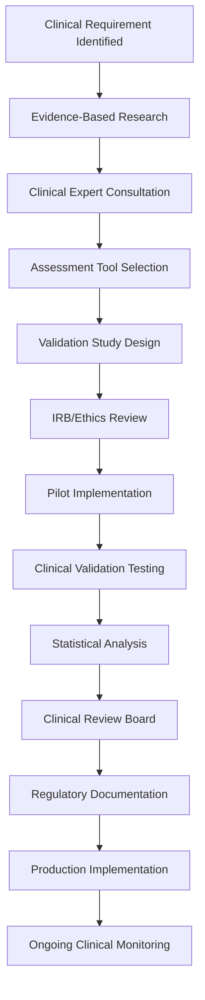
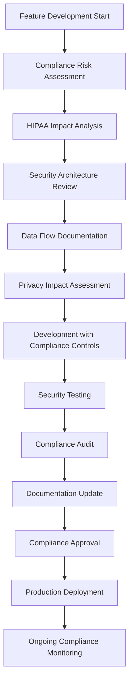

# BMad Healthcare Domain Configuration

## BMad Method Adaptation for Mental Wellness

### Healthcare-Specific BMad Templates

#### Clinical Development Template
```yaml
# bmad-healthcare-template.yml
domain: healthcare
subdomain: mental_wellness
compliance_requirements:
  - HIPAA
  - SOC2_TYPE_II
  - FDA_DIGITAL_THERAPEUTICS
  - GDPR
  - CCPA

development_phases:
  clinical_validation:
    duration: "8-12 weeks"
    activities:
      - evidence_based_research
      - clinical_assessment_integration
      - crisis_intervention_protocols
      - provider_workflow_design
    deliverables:
      - clinical_requirements_document
      - assessment_validation_report
      - crisis_response_procedures
      - provider_integration_specs

  regulatory_preparation:
    duration: "4-6 weeks"
    activities:
      - hipaa_compliance_audit
      - data_security_implementation
      - privacy_policy_development
      - clinical_evidence_compilation
    deliverables:
      - compliance_documentation
      - security_audit_report
      - privacy_impact_assessment
      - clinical_validation_study

quality_gates:
  - clinical_review
  - security_audit
  - accessibility_compliance
  - crisis_response_testing
  - provider_user_acceptance

risk_mitigation:
  patient_safety:
    - automated_crisis_detection
    - immediate_intervention_protocols
    - healthcare_provider_alerts
    - emergency_service_integration

  data_security:
    - end_to_end_encryption
    - access_audit_logging
    - data_minimization
    - secure_backup_procedures
```

#### Clinical User Stories Template
```markdown
## Epic: Crisis Intervention System

### User Story: Emergency Crisis Detection
**As a** mental health patient using the app
**I want** the system to automatically detect when I'm in crisis
**So that** I can receive immediate support and intervention

**Clinical Acceptance Criteria:**
- System detects crisis indicators based on PHQ-9 scores ≥20 or GAD-7 scores ≥15
- Crisis detection triggers immediate intervention within 30 seconds
- Emergency contacts are automatically notified via SMS and email
- Crisis resources (988 hotline, Crisis Text Line) are prominently displayed
- Safety planning tools are immediately accessible
- Healthcare provider receives real-time alert if connected

**Clinical Validation:**
- Algorithm tested against validated clinical crisis markers
- False positive rate <5% to prevent alert fatigue
- Integration tested with actual crisis hotline protocols
- Provider alert system tested with healthcare facilities

**Regulatory Compliance:**
- Crisis intervention documented for clinical records
- Patient consent obtained for emergency contact notification
- Data handling meets HIPAA crisis intervention requirements
- Audit trail maintained for all crisis-related actions
```

### Healthcare BMad Workflows

#### Clinical Assessment Workflow


#### Compliance Integration Process


### BMad Healthcare Metrics

#### Clinical Effectiveness KPIs
```yaml
clinical_outcomes:
  primary_metrics:
    - patient_engagement_rate: ">80% weekly active usage"
    - assessment_completion_rate: ">90% for scheduled assessments"
    - crisis_detection_accuracy: ">95% true positive rate"
    - intervention_response_time: "<30 seconds for crisis alerts"

  secondary_metrics:
    - mood_improvement_trends: "Track PHQ-9/GAD-7 score improvements"
    - provider_satisfaction: ">4.5/5 healthcare provider rating"
    - clinical_workflow_efficiency: "Reduce provider documentation time by 40%"
    - patient_safety_incidents: "Zero preventable safety incidents"

quality_metrics:
  accessibility:
    - wcag_compliance: "WCAG 2.1 AA certification"
    - screen_reader_compatibility: "100% core feature accessibility"
    - cognitive_load_assessment: "Mental health-specific usability testing"

  reliability:
    - system_uptime: "99.9% for core features, 99.99% for crisis features"
    - crisis_alert_delivery: "100% delivery rate within SLA"
    - data_backup_integrity: "Daily validation with 100% success rate"

compliance_metrics:
  security:
    - vulnerability_scan_results: "Zero high/critical vulnerabilities"
    - penetration_test_score: "Pass all security assessments"
    - encryption_coverage: "100% of health data encrypted"

  privacy:
    - consent_management: "100% explicit consent for data processing"
    - data_request_fulfillment: "Complete GDPR/CCPA requests within 30 days"
    - audit_trail_completeness: "100% of data access logged and traceable"
```

### Development Guidelines for Healthcare

#### Code Quality Standards
```typescript
// Healthcare-specific code annotations
interface HealthcareComponent {
  // HIPAA Compliance: Ensure no PHI in logs
  logLevel: 'error' | 'warn';  // Never 'debug' or 'info' in production

  // Clinical Safety: All user inputs validated
  validateInput: (input: any) => boolean;

  // Crisis Safety: Immediate response required
  emergencyResponseTime: number; // Must be <= 30000ms

  // Accessibility: Screen reader compatible
  ariaLabels: Record<string, string>;

  // Audit Trail: All actions logged
  auditLog: (action: string, userId: string, timestamp: Date) => void;
}

// Clinical validation decorators
@ClinicallyValidated('PHQ-9', 'version-2.0')
@HIPA_Compliant('field-level-encryption')
@CrisisSafe('immediate-intervention')
class ClinicalAssessment {
  // Implementation must meet clinical standards
}
```

#### Testing Requirements
```yaml
testing_standards:
  clinical_validation:
    - unit_tests: "95% coverage for clinical algorithms"
    - integration_tests: "All clinical workflows end-to-end"
    - clinical_scenario_tests: "Real patient journey simulations"
    - crisis_response_tests: "Emergency intervention scenarios"

  security_testing:
    - penetration_testing: "Quarterly by certified healthcare security firm"
    - vulnerability_scanning: "Weekly automated scans"
    - access_control_testing: "Role-based permission validation"
    - encryption_testing: "Data protection verification"

  usability_testing:
    - accessibility_testing: "Screen reader and cognitive accessibility"
    - clinical_workflow_testing: "Healthcare provider usability studies"
    - patient_journey_testing: "Mental health patient experience validation"
    - crisis_situation_testing: "High-stress scenario usability"
```

### Deployment Pipeline for Healthcare

#### Production Deployment Checklist
```markdown
## Pre-Deployment Healthcare Checklist

### Clinical Validation
- [ ] Clinical expert review completed
- [ ] Assessment algorithms validated against clinical standards
- [ ] Crisis intervention protocols tested and approved
- [ ] Provider workflow integration verified

### Compliance Verification
- [ ] HIPAA compliance audit passed
- [ ] Data encryption verified (at rest and in transit)
- [ ] Access controls tested and documented
- [ ] Audit logging confirmed operational

### Security Assessment
- [ ] Penetration testing completed with no high-risk findings
- [ ] Vulnerability scan passed
- [ ] Security incident response plan updated
- [ ] Data backup and recovery tested

### Quality Assurance
- [ ] Accessibility compliance (WCAG 2.1 AA) verified
- [ ] Performance testing completed (crisis features <30s response)
- [ ] Load testing passed for expected user volume
- [ ] Disaster recovery procedures tested

### Documentation
- [ ] Clinical documentation updated
- [ ] Compliance documentation current
- [ ] User manuals updated for healthcare providers
- [ ] Technical documentation complete

### Approval Gates
- [ ] Clinical review board approval
- [ ] Security team sign-off
- [ ] Compliance officer approval
- [ ] Product owner final approval
```

### Incident Response for Healthcare

#### Crisis Event Response Protocol
```yaml
incident_types:
  patient_safety:
    severity: "P0 - Critical"
    response_time: "Immediate (< 5 minutes)"
    escalation: "Clinical director, Legal, C-suite"
    actions:
      - immediate_system_assessment
      - patient_impact_evaluation
      - crisis_intervention_verification
      - regulatory_notification_preparation

  data_breach:
    severity: "P0 - Critical"
    response_time: "Immediate (< 15 minutes)"
    escalation: "Security team, Legal, Compliance, C-suite"
    actions:
      - breach_containment
      - patient_data_impact_assessment
      - regulatory_notification (HIPAA breach < 72 hours)
      - patient_notification_preparation

  clinical_algorithm_failure:
    severity: "P1 - High"
    response_time: "< 30 minutes"
    escalation: "Clinical team, Engineering lead"
    actions:
      - algorithm_validation_check
      - patient_assessment_review
      - clinical_expert_consultation
      - system_rollback_if_necessary

monitoring_alerts:
  crisis_detection_failure:
    threshold: "Any missed crisis indicator"
    notification: "Immediate SMS + email to on-call clinical team"

  assessment_scoring_anomaly:
    threshold: "Scoring variance > 10% from validated algorithms"
    notification: "Real-time alert to clinical validation team"

  provider_alert_delivery_failure:
    threshold: "Any failed provider notification"
    notification: "Immediate escalation to clinical operations"
```