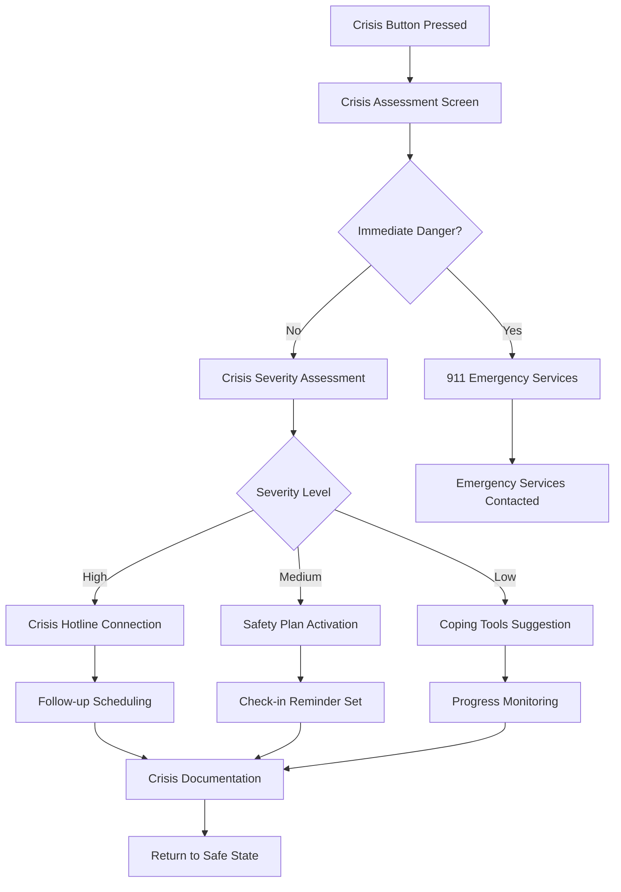
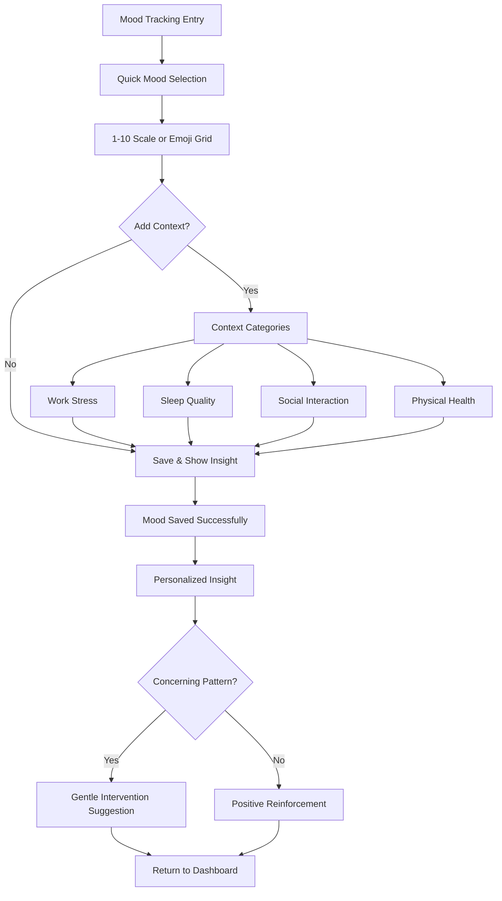
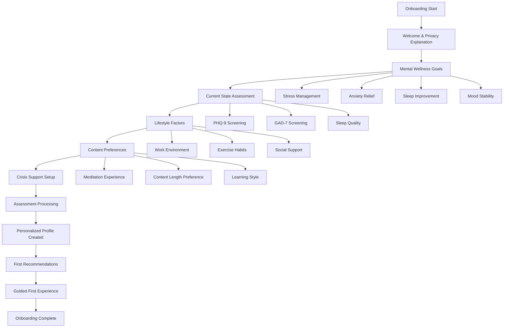

# Mental Wellness App UI/UX Specification

## Introduction

This document defines the user experience goals, information architecture, user flows, and visual design specifications for **Mental Wellness App**'s user interface. It serves as the foundation for visual design and frontend development, ensuring a cohesive and user-centered therapeutic experience.

### Overall UX Goals & Principles

#### Target User Personas

**Primary Persona - Young Professionals (25-35):**
Career-focused individuals experiencing work-life balance challenges who need efficient, credible wellness tools that fit into busy schedules while providing clinical-grade support.

**Secondary Persona - Gen Z Students & Early Career (18-25):**
Digital natives facing academic pressure and social anxiety who prefer social proof-driven, community-oriented experiences with accessible pricing models.

**Tertiary Persona - Working Parents (30-50):**
Time-constrained parents managing family responsibilities who need family-focused wellness solutions with clear value propositions and safety prioritization.

#### Usability Goals

1. **Immediate Access to Crisis Support:** Emergency resources accessible within 2 taps from any screen
2. **Effortless Daily Tracking:** Mood logging completable in under 30 seconds
3. **Credible Clinical Feel:** Interface conveys professional healthcare standards while remaining approachable
4. **Progressive Onboarding:** Complex personalization spread across multiple sessions to prevent overwhelming new users
5. **Cross-Device Continuity:** Seamless experience across mobile, tablet, and desktop for different use contexts

#### Design Principles

1. **Calm Authority** - Professional healthcare credibility with soothing, stress-reducing aesthetics
2. **Immediate Clarity** - Critical functions (crisis support, mood tracking) are always visible and unambiguous
3. **Respectful Privacy** - Design elements clearly communicate data security and user control
4. **Adaptive Complexity** - Progressive disclosure that grows sophistication with user engagement
5. **Inclusive Accessibility** - Design for varying cognitive states and mental health conditions from the start

### Change Log

| Date | Version | Description | Author |
|------|---------|-------------|---------|
| 2024-09-21 | 1.0 | Initial UI/UX specification creation | UX Expert |

## Information Architecture (IA)

### Site Map / Screen Inventory

```mermaid
graph TD
    A[Welcome/Landing] --> B[Authentication]
    B --> C[Onboarding Assessment]
    C --> D[Main Dashboard]

    D --> E[Wellness Tools]
    D --> F[Progress Analytics]
    D --> G[Profile & Settings]
    D --> H[Crisis Support Hub]

    E --> E1[Daily Mood Tracking]
    E --> E2[Meditation Library]
    E --> E3[Stress Response Tools]
    E --> E4[Sleep Optimization]
    E --> E5[Educational Content]

    F --> F1[Mood Trends Charts]
    F --> F2[Goal Progress]
    F --> F3[Wellness Insights]
    F --> F4[Clinical Assessments]

    G --> G1[Personal Profile]
    G --> G2[Privacy Settings]
    G --> G3[Notification Preferences]
    G --> G4[Subscription Management]
    G --> G5[Data Export]

    H --> H1[Emergency Contacts]
    H --> H2[Crisis Resources]
    H --> H3[Safety Planning]
    H --> H4[Professional Support]

    D --> I[Provider Portal]
    I --> I1[Patient Dashboard]
    I --> I2[Clinical Notes]
    I --> I3[Assessment Reviews]
    I --> I4[Communication Tools]

    D --> J[Enterprise Dashboard]
    J --> J1[Population Health]
    J --> J2[Program Analytics]
    J --> J3[ROI Metrics]
    J --> J4[User Management]
```

### Navigation Structure

**Primary Navigation:**
Fixed bottom tab navigation (mobile) / left sidebar (desktop) with four core sections:
- Dashboard (home icon) - Today's wellness overview and quick actions
- Tools (toolkit icon) - All wellness intervention tools and content
- Progress (chart icon) - Analytics, trends, and goal tracking
- Profile (person icon) - Settings, account management, and crisis support

**Secondary Navigation:**
Contextual sub-navigation within each primary section using horizontal tabs or dropdown menus. Crisis support maintains persistent floating action button overlay.

**Breadcrumb Strategy:**
Minimal breadcrumbs for deep content (educational articles, meditation sessions) with clear "back to [section]" navigation. Healthcare provider portal uses full breadcrumb navigation for clinical workflow compliance.

## User Flows

### Flow 1: Crisis Intervention Access

**User Goal:** Get immediate help during a mental health emergency

**Entry Points:**
- Persistent crisis button on all screens
- Voice activation "I need help"
- Automatic trigger from mood assessment scores

**Success Criteria:** User connects with appropriate level of support within 60 seconds

#### Flow Diagram

#### Edge Cases & Error Handling:
- Network connectivity issues: Offline crisis resources and emergency contact list
- Location services disabled: Manual location entry for emergency services
- User cancellation: Gentle re-engagement without pressure
- Provider unavailable: Alternative resource routing with warm handoff

### Flow 2: Daily Mood Tracking

**User Goal:** Quickly log current emotional state for pattern tracking

**Entry Points:**
- Dashboard quick action button
- Scheduled notification reminder
- Voice command "log my mood"

**Success Criteria:** Mood logged with contextual information in under 30 seconds

#### Flow Diagram

#### Edge Cases & Error Handling:
- Offline logging: Store locally and sync when connected
- Missed days: Gentle reminder without guilt
- Concerning trends: Progressive intervention escalation
- User fatigue: Simplified quick-log options

### Flow 3: Personalized Onboarding

**User Goal:** Complete initial assessment to receive personalized wellness recommendations

**Entry Points:**
- First app launch after registration
- Settings menu for reassessment

**Success Criteria:** User completes assessment and receives first personalized content recommendations

#### Flow Diagram

#### Edge Cases & Error Handling:
- Assessment abandonment: Save progress and gentle re-engagement
- Clinical score concerns: Immediate resource provision and optional provider connection
- Incomplete information: Progressive completion over multiple sessions
- Changed circumstances: Easy reassessment access

## Wireframes & Mockups

**Primary Design Files:** To be created in Figma with component library and interactive prototypes

### Key Screen Layouts

#### Main Dashboard

**Purpose:** Central hub providing today's wellness overview with quick access to core functions

**Key Elements:**
- Welcome message with personalized greeting and time-based wellness tips
- Crisis support floating action button (persistent, high-contrast red)
- Today's mood status with quick re-log option
- Personalized content recommendations (meditation, articles, tools)
- Progress summary widgets (streak counters, goal achievements)
- Quick action cards for most-used tools (mood tracking, breathing exercises)
- Gentle reminder nudges for missed activities without creating guilt

**Interaction Notes:** Swipe-able content cards, pull-to-refresh for new recommendations, haptic feedback for crisis button

**Design File Reference:** dashboard-main.figma

#### Crisis Support Interface

**Purpose:** Immediate crisis intervention with clear escalation paths and calming design

**Key Elements:**
- Large, clear "I'm in Crisis" and "I Need Support" distinction buttons
- Progressive assessment with calming colors and simple language
- Emergency services quick-dial with location sharing
- Personal crisis plan access with customized coping strategies
- Provider contact information with availability status
- Follow-up scheduling and check-in reminders

**Interaction Notes:** Voice activation support, one-tap emergency dialing, offline resource access

**Design File Reference:** crisis-support.figma

#### Mood Tracking Interface

**Purpose:** Fast, intuitive mood logging with optional contextual information

**Key Elements:**
- Visual mood scale with customizable options (numerical, emoji, color gradient)
- Context tagging with pre-defined and custom categories
- Previous mood display for comparison
- Quick note entry with voice-to-text support
- Immediate insight feedback based on patterns
- Privacy reminder and data control options

**Interaction Notes:** Gesture-based selection, auto-save on selection, undo option within 5 seconds

**Design File Reference:** mood-tracking.figma

#### Provider Portal Dashboard

**Purpose:** Clinical workflow interface for healthcare providers monitoring patient progress

**Key Elements:**
- Patient list with priority indicators and recent activity status
- Individual patient dashboard with comprehensive wellness data visualization
- Clinical assessment results with trend analysis and risk stratification
- Secure messaging interface with read receipts and urgency indicators
- Treatment plan integration with homework assignment tracking
- Alert management for patients showing concerning patterns

**Interaction Notes:** Keyboard shortcuts for efficiency, bulk patient management, export functionality for clinical documentation

**Design File Reference:** provider-portal.figma

## Component Library / Design System

**Design System Approach:** Custom design system built on healthcare design principles with Tailwind CSS implementation, optimized for mental wellness use cases and accessibility compliance

### Core Components

#### Crisis Button Component

**Purpose:** Persistent emergency access button maintaining visibility and accessibility across all interfaces

**Variants:**
- Floating action button (primary)
- Header emergency link (secondary)
- Voice activation trigger (accessibility)

**States:**
- Default: High-contrast red with white icon
- Hover/Focus: Slight scale increase with glow effect
- Pressed: Immediate visual feedback with haptic response
- Loading: Spinner with "Connecting..." text

**Usage Guidelines:** Always visible, never hidden by other UI elements, maintains consistent positioning across platforms

#### Mood Scale Component

**Purpose:** Standardized mood input interface with multiple visualization options

**Variants:**
- Numerical scale (1-10 slider)
- Emoji grid (happy to sad faces)
- Color gradient (green to red spectrum)
- Simple binary (good day/difficult day)

**States:**
- Empty: Neutral state prompting selection
- Selected: Visual confirmation with gentle animation
- Confirmed: Saved state with success indicator
- Editable: Option to modify within session

**Usage Guidelines:** Maintain consistency in mood representation across all analytics and reporting

#### Clinical Assessment Card

**Purpose:** Standardized presentation of validated clinical assessment tools and results

**Variants:**
- Assessment invitation (pre-completion)
- In-progress assessment with progress indicator
- Results display with clinical interpretation
- Historical comparison view

**States:**
- Available: Clear call-to-action for new assessments
- Recommended: Gentle nudge based on patterns
- Overdue: Respectful reminder without pressure
- Completed: Results summary with provider sharing option

**Usage Guidelines:** Maintain clinical credibility while avoiding intimidation, clear privacy controls

## Branding & Style Guide

**Brand Guidelines:** Mental wellness therapeutic design principles balancing clinical credibility with calming wellness aesthetics

### Visual Identity

Our visual identity conveys **clinical credibility** through professional healthcare design patterns while maintaining the **calming wellness** aesthetic essential for mental health users. The design system supports users across varying cognitive and emotional states.

### Color Palette

| Color Type | Hex Code | Usage |
|------------|----------|--------|
| Primary | #2563EB | Trust-building elements, clinical features, provider portal |
| Secondary | #059669 | Positive reinforcement, progress indicators, goal achievements |
| Accent | #7C3AED | Personalization elements, premium features, insights |
| Success | #10B981 | Positive feedback, completed actions, wellness achievements |
| Warning | #F59E0B | Important notices, assessment reminders, gentle alerts |
| Error | #EF4444 | Crisis support, urgent actions, critical notifications |
| Neutral | #6B7280 / #F9FAFB | Text hierarchy, borders, background layers |
| Calming Base | #F0F9FF | Primary background, meditation interfaces, calming spaces |
| Clinical Accent | #E0E7FF | Provider interfaces, clinical data presentation |

### Typography

#### Font Families
- **Primary:** Inter (clean, readable, healthcare-standard sans-serif)
- **Secondary:** Source Serif Pro (clinical documentation, formal content)
- **Monospace:** JetBrains Mono (data displays, technical interfaces)

#### Type Scale

| Element | Size | Weight | Line Height |
|---------|------|--------|-------------|
| H1 | 2.25rem (36px) | 700 | 1.2 |
| H2 | 1.875rem (30px) | 600 | 1.3 |
| H3 | 1.5rem (24px) | 600 | 1.4 |
| Body | 1rem (16px) | 400 | 1.6 |
| Small | 0.875rem (14px) | 400 | 1.5 |
| Caption | 0.75rem (12px) | 500 | 1.4 |

### Iconography

**Icon Library:** Lucide React with custom mental wellness icons for therapeutic concepts

**Usage Guidelines:**
- 24px standard size for UI elements, 16px for inline text
- Consistent stroke width (1.5px) across all icons
- Custom icons for mental health concepts (mood states, wellness activities, clinical tools)
- High contrast versions for accessibility compliance

### Spacing & Layout

**Grid System:** 8px base unit with 4px micro-spacing for fine adjustments

**Spacing Scale:** 4px, 8px, 12px, 16px, 24px, 32px, 48px, 64px, 96px, 128px

## Accessibility Requirements

### Compliance Target

**Standard:** WCAG 2.1 AA compliance with specific mental health user considerations

### Key Requirements

**Visual:**
- Color contrast ratios: 4.5:1 for normal text, 3:1 for large text, 7:1 for crisis elements
- Focus indicators: 2px solid outline with 2px offset, high contrast colors
- Text sizing: Minimum 16px base size, scalable to 200% without horizontal scrolling

**Interaction:**
- Keyboard navigation: Full functionality without mouse, logical tab order, skip links
- Screen reader support: Semantic HTML, ARIA labels, live regions for dynamic content
- Touch targets: Minimum 44px touch targets, adequate spacing between interactive elements

**Content:**
- Alternative text: Descriptive alt text for all images, empty alt for decorative elements
- Heading structure: Logical heading hierarchy, no skipped heading levels
- Form labels: Clear, descriptive labels for all form inputs, error messages clearly associated

**Mental Health Specific:**
- Reduced motion options: Respect prefers-reduced-motion, provide static alternatives
- Cognitive load management: Clear information hierarchy, progressive disclosure
- Crisis accessibility: Voice activation, large touch targets, high contrast emergency elements
- Content warnings: Clear labeling for potentially triggering content

### Testing Strategy

**Automated Testing:**
- Axe-core integration in CI/CD pipeline
- Color contrast validation tools
- Keyboard navigation testing

**Manual Testing:**
- Screen reader testing (NVDA, JAWS, VoiceOver)
- Voice control testing (Dragon, Voice Control)
- Cognitive load assessment with mental health advocates
- Crisis scenario accessibility testing with emergency response simulation

**User Testing:**
- Accessibility testing with users experiencing various mental health conditions
- Cognitive accessibility testing during different emotional states
- Crisis intervention accessibility validation

## Responsiveness Strategy

### Breakpoints

| Breakpoint | Min Width | Max Width | Target Devices |
|------------|-----------|-----------|----------------|
| Mobile | 320px | 767px | Smartphones, primary crisis access |
| Tablet | 768px | 1023px | Tablets, meditation sessions, provider mobile |
| Desktop | 1024px | 1439px | Laptops, provider portals, enterprise dashboards |
| Wide | 1440px | - | Large monitors, multi-panel clinical interfaces |

### Adaptation Patterns

**Layout Changes:**
- Mobile: Single-column layout with bottom navigation
- Tablet: Two-column adaptive layout with sidebar navigation
- Desktop: Multi-column layout with persistent left navigation
- Wide: Three-panel layout with dedicated crisis support panel

**Navigation Changes:**
- Mobile: Bottom tab bar with crisis FAB overlay
- Tablet: Side navigation with contextual top tabs
- Desktop: Persistent left sidebar with breadcrumb navigation
- Wide: Multi-level navigation with dedicated sections

**Content Priority:**
- Mobile: Crisis support → Mood tracking → Today's insights → Content discovery
- Tablet: Crisis support → Dashboard overview → Tools access → Progress tracking
- Desktop: Full dashboard → Provider integration → Advanced analytics
- Wide: Comprehensive workspace → Multi-patient views → Research capabilities

**Interaction Changes:**
- Mobile: Touch-optimized, gesture-based navigation, voice activation priority
- Tablet: Mixed touch and precision interactions, stylus support for assessments
- Desktop: Keyboard shortcuts, hover states, right-click context menus
- Wide: Power user features, bulk operations, multi-window management

## Animation & Micro-interactions

### Motion Principles

**Therapeutic Motion Design:**
- **Calming Transitions:** Gentle, organic easing curves that reduce anxiety rather than create excitement
- **Purposeful Animation:** Every motion serves a functional purpose (feedback, guidance, state change)
- **Respectful Timing:** Slower, more deliberate animations that don't overwhelm users in distress
- **Reduced Motion Support:** Full static alternatives for users with vestibular disorders or motion sensitivity

### Key Animations

- **Mood Selection:** Gentle scale and color transition (Duration: 300ms, Easing: ease-out)
- **Crisis Button Pulse:** Subtle breathing effect to indicate availability (Duration: 2000ms, Easing: ease-in-out)
- **Progress Updates:** Satisfying progress bar fills with celebration micro-animation (Duration: 800ms, Easing: ease-out)
- **Content Loading:** Skeleton screens with gentle shimmer effect (Duration: 1500ms, Easing: linear)
- **Page Transitions:** Slide transitions with blur backdrop (Duration: 400ms, Easing: ease-in-out)
- **Notification Appearance:** Gentle slide-down with bounce settle (Duration: 500ms, Easing: cubic-bezier)
- **Assessment Progress:** Step-by-step progress indication with calming color shifts (Duration: 250ms, Easing: ease-out)

## Performance Considerations

### Performance Goals

- **Page Load:** Initial page load under 2 seconds on 3G networks
- **Interaction Response:** UI feedback within 100ms, complete interactions under 1 second
- **Animation FPS:** Maintain 60fps for all animations, 30fps minimum for complex transitions

### Design Strategies

**Image Optimization:**
- Next.js Image component for automatic optimization and lazy loading
- WebP format with fallbacks for meditation imagery and wellness content
- Progressive loading for assessment imagery and educational content

**Code Splitting:**
- Route-based code splitting for different user types (consumer, provider, enterprise)
- Component-level splitting for heavy features (analytics dashboards, clinical tools)
- Progressive enhancement for advanced features

**Critical Rendering Path:**
- Inline critical CSS for above-the-fold content
- Preload essential fonts (Inter) and defer decorative fonts
- Prioritize crisis support and mood tracking functionality in initial bundle

**Caching Strategy:**
- Service worker for offline crisis resources and core functionality
- CDN caching for static wellness content and meditation audio
- Intelligent prefetching for personalized content recommendations

## Next Steps

### Immediate Actions

1. **Stakeholder Review** - Present UX specification to clinical advisors and target user representatives
2. **Figma Design System Creation** - Build comprehensive component library with all specified elements
3. **Accessibility Audit Preparation** - Set up testing protocols and stakeholder review with accessibility experts
4. **Clinical Interface Validation** - Review provider portal designs with healthcare professionals
5. **Crisis Flow Testing** - Validate emergency intervention flows with crisis intervention specialists

### Design Handoff Checklist

- [x] All user flows documented with edge cases and error states
- [x] Component inventory complete with variants and states
- [x] Accessibility requirements defined with testing strategy
- [x] Responsive strategy clear with breakpoint specifications
- [x] Brand guidelines incorporated with clinical credibility focus
- [x] Performance goals established with optimization strategies
- [x] Mental health specific considerations integrated throughout
- [x] Crisis intervention workflows prioritized and detailed
- [x] Provider portal requirements specified for clinical workflows
- [x] Animation specifications balance therapeutic needs with usability

### Architect Handoff Notes

**Priority Development Order:**
1. Crisis support components and infrastructure (highest priority)
2. Authentication and onboarding flow
3. Core mood tracking and dashboard functionality
4. Provider portal basic features
5. Advanced analytics and enterprise features

**Technical Implementation Considerations:**
- Implement crisis support as progressive web app for offline access
- Use Supabase real-time subscriptions for crisis intervention notifications
- Ensure HIPAA-compliant data handling in all UI components
- Build responsive design mobile-first for crisis accessibility
- Integrate voice activation APIs for hands-free crisis support

The UX specification successfully balances clinical credibility with user-centered wellness design, providing a comprehensive foundation for building a therapeutic interface that serves both individual users and healthcare providers while maintaining the highest standards of accessibility and mental health sensitivity.